This blog explains a breakdown of the Broken Authentication vulnerbility in Change Bender's password of OWASP juice shop

## Overview on the JS website

- Get Bender's email address from
  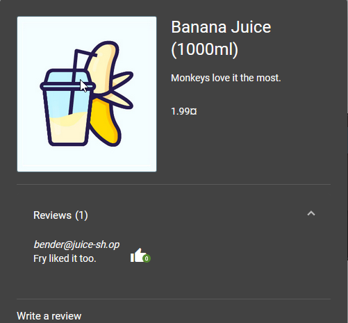
- Login with `bender@juice-sh.op'--`
  and any password: asdf
- Go to change password
- Attempt changing password
- See request on brupsuite
- Remove repeat parameter and try, observe change
- Remove current parameter and seee changes
  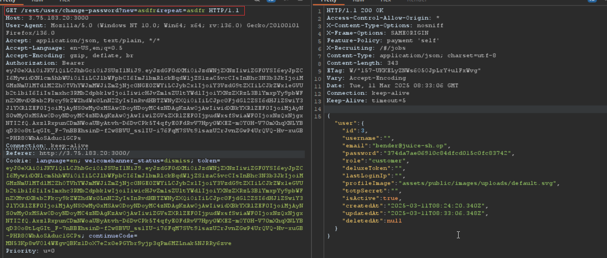

So we were able to change Bender's password. We get a 200 OK Successful.

Notice lots of info on the Bender user that we didn't have before now.

To solve this challenage password should be changed to: slurmCl4ssic
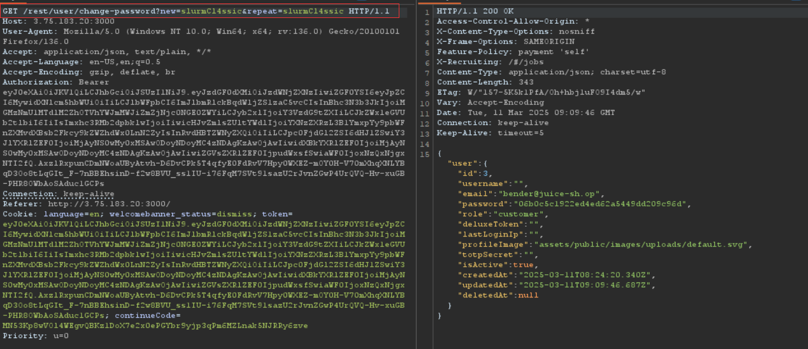
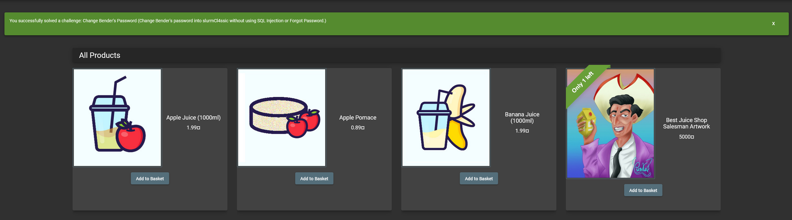

## Login Bjoern

- Go to the /#/adminitsration URL. We see a list of registered users
  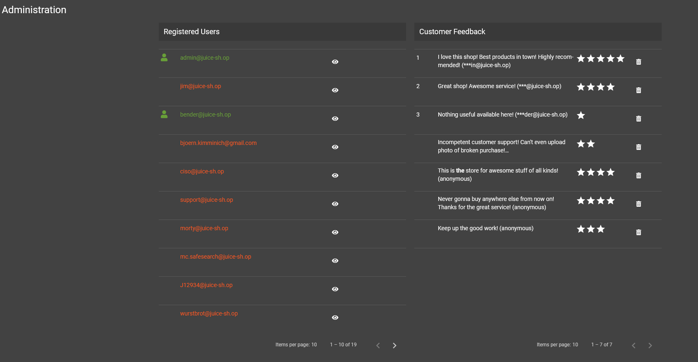
- Take Bjorn's email address: `bjoern.kimminich@gmail.com`
- Notice that the email address is @gmail.com. People could mostly use this for OAuth login mechanism. He does not necessarily need to have an account, he can just login in with his google account
- We could check if the OAuth Login is implemented correctly. Goto Insoect page > Debugger > main.js > click on pretty print below
  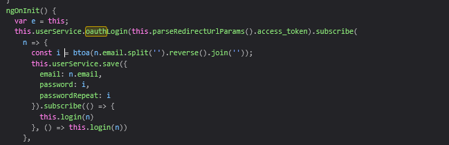

- We see that email is saved in param `n.email` and password, is saved in variable `i`
- `i` has been declared to have btoa function, where the email is sesnt to the function, then split first and then reverese and joined -`btoa` is a method that encodes a string in base64.
- So the output is a base64 string, the input is the email where is it is split and rejoined
- Go to console tab, split by every letter of the email
  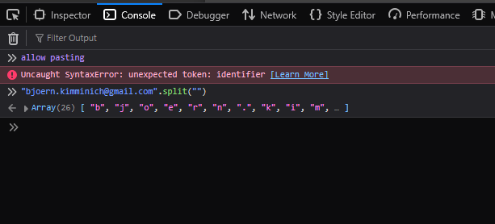
- We see that we have an array
- Then reverse `"bjoern.kimminich@gmail.com".split("").reverse()`
- and join `"bjoern.kimminich@gmail.com".split("").reverse().join("")`
  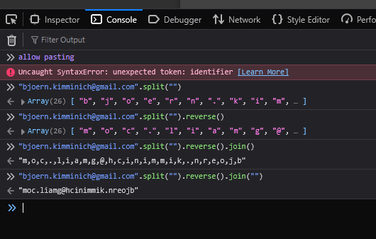
- Go to online to check how btoa function is used
- We see `window.btoa(string)`. So that is: `window.btoa("bjoern.kimminich@gmail.com".split("").reverse().join(""))`
  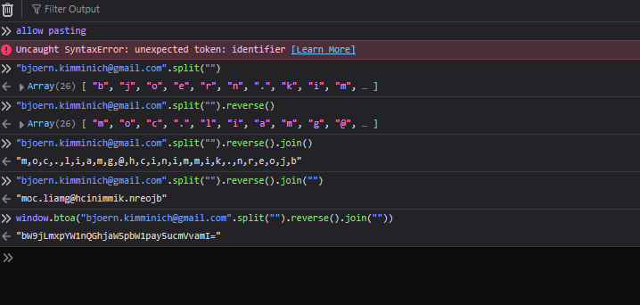
- We see that we get a base64 string `bW9jLmxpYW1nQGhjaW5pbW1pay5ucmVvamI=`
- Going back to the code, we see that this strinhg was assigned to variable `i` and password is assigned to `i`. try insert this as the login password and see.
  
- Logout, go to the account login page and try to login as bjorn using the credential set
  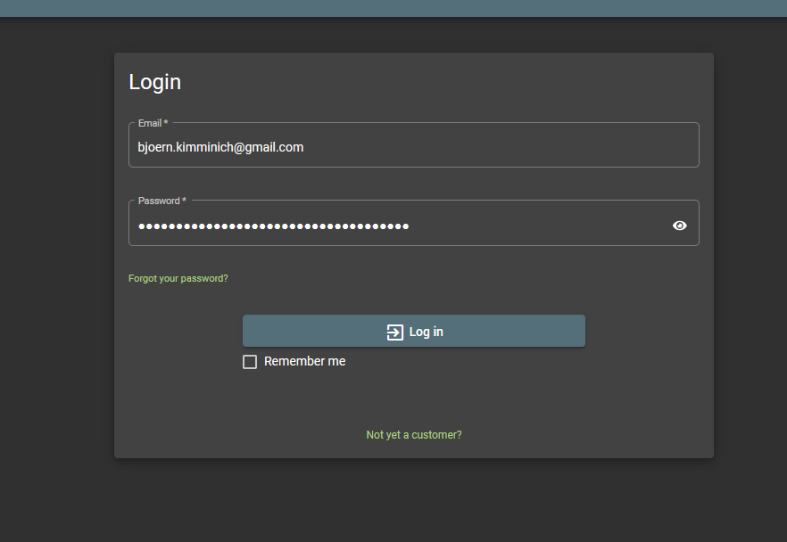

We are logged in as Bjorn
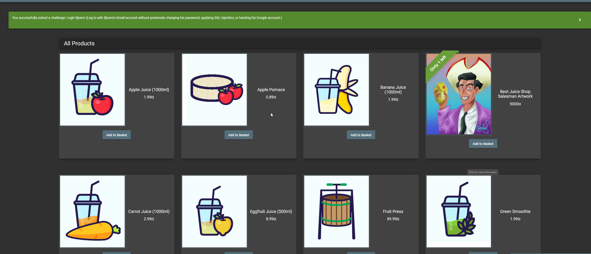
