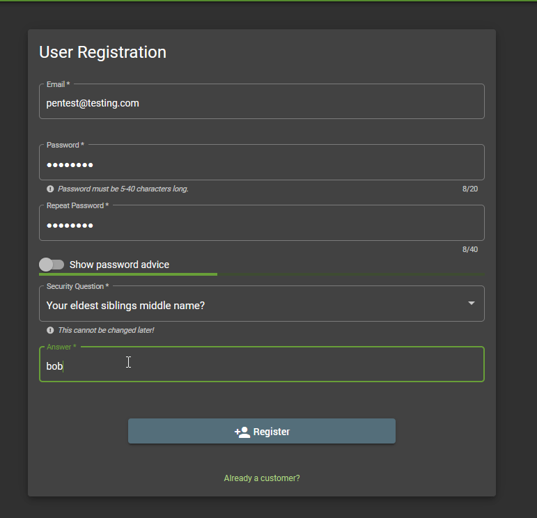
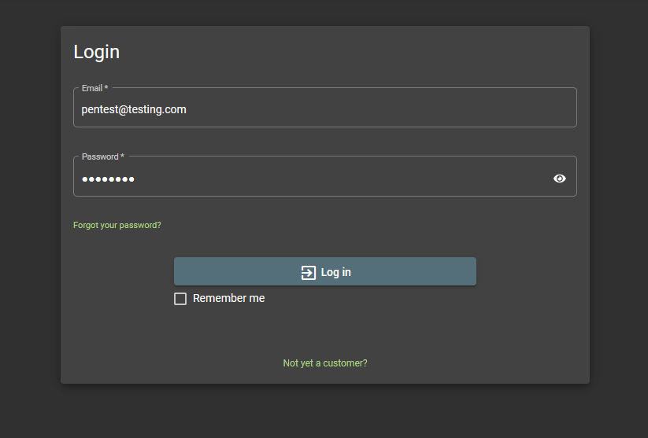
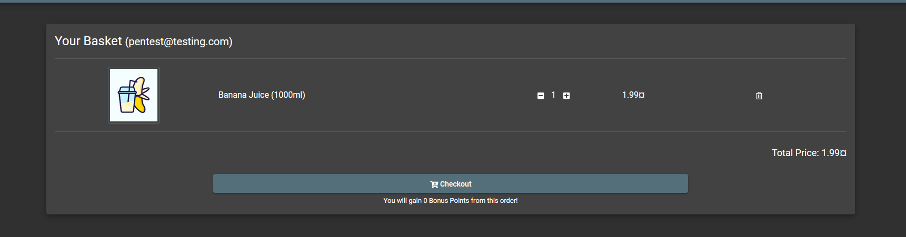
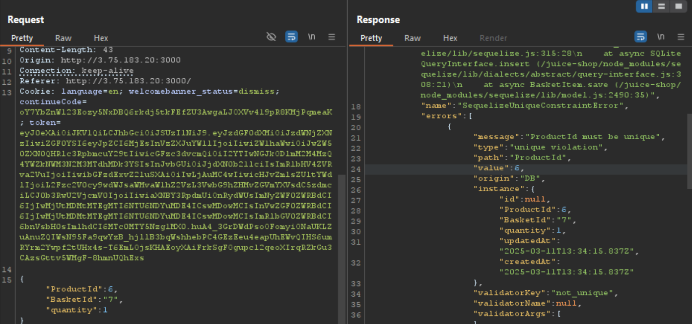
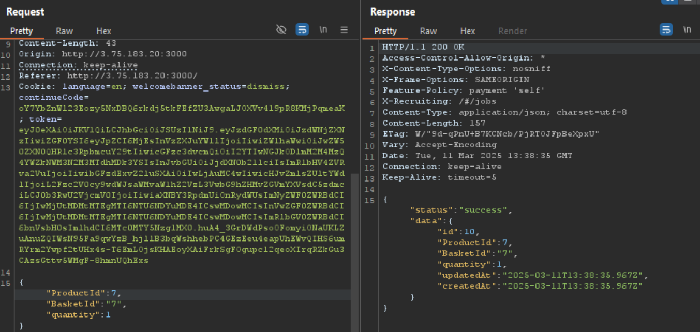
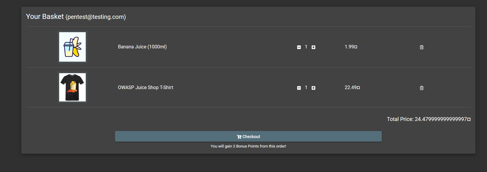
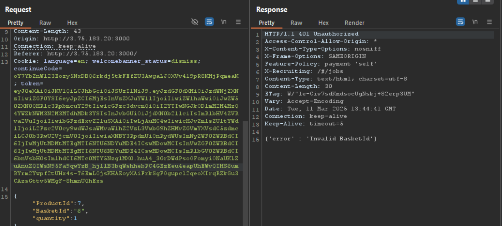
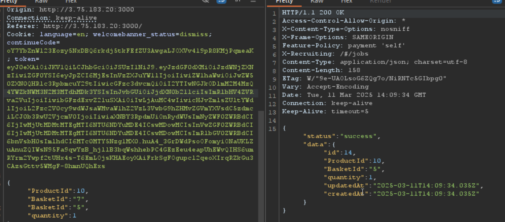

This blog explains a breakdown of the Broken Access Control in the OWASP juice shop website.

## Manipulate Basket

Put another product in another user's shopping Basket

- Go to Account > Login > register new user
  
- Now login with new user
  
- Go to basket. See that it's empty
- Go to Home page and add Banana Juice to basket
  

- Go to burp and check request
- See the productId, BascketId and quantity
- Send request again, we see a product id validation error
  
- Change productid and try again
  
  Noe we get a success reponse
- Let's check our basket for the added product
  
- We see a T-Shirt
- Now, that we understand the functionality, let's see if we can add something to another basket that we shouldn't have access to
- Change basketid to 6, we et 401 unauthorized error. Now, what can we do to circumvent this control
  

- There are fairly various mechanisms to bypass access control

[See OWASP parameter pollution strategies](https://owasp.org/www-project-web-security-testing-guide/latest/4-Web_Application_Security_Testing/07-Input_Validation_Testing/04-Testing_for_HTTP_Parameter_Pollution)

We could try to send the request with the parameter twice

- So, what we're trying to do here is parameter pollution.

- After lots of maniputlation, we get a successful addition
  
- We see that using the actual basketid first before the target basket leads us to add items to a basket we originally should not have contorl over.
