# Ransomware on S3 - Simulation and Detection

This blog explains what to do or consider when investigating a ransomware scenarion that involves data exfiltration in AWS. We will explore the use of Athena to query Cloudtrail event logs.
A big shout out to Matej Macek for granting me access to this AWS workshop playground. The workshop is available [here]('https://catalog.workshops.aws/aws-cirt-ransomware-simulation-and-detection/en-US') and can be spinned up in different environment like the AWS free-tier env, and followed through.


## Setup
Download the cloud formation config file. and upload in Cloud formation

## Reviewing Logs
The key thing to look out for is the `eventname`. This gives us an idea of the action being performed or the API call made to the AWS Account. Common events to look out for include: 
- `CreateUser`
- `DescribeInstances`
- `RunInstances`
Please review some of the list and their descriptions [here]('https://catalog.us-east-1.prod.workshops.aws/event/dashboard/en-US/workshop/review').

For Querying Cloudtrail logs, we use Athena. In here, for queuries used over and over again, you find them in saved Queries. That is, if your team saved them. You can also save different queries in different work groups.


To test queries:
- Fetch data from `irworkshopgluedatabase` from the `irworkshopgluetablevpcflow` table. Limit result to 10
```SQL
SELECT * FROM "irworkshopgluedatabase"."irworkshopgluetablevpcflow" limit 10;
```
Here, we are fetching from the `AWSDataCatalog` as our datasource and we have mentioned the database and table above.
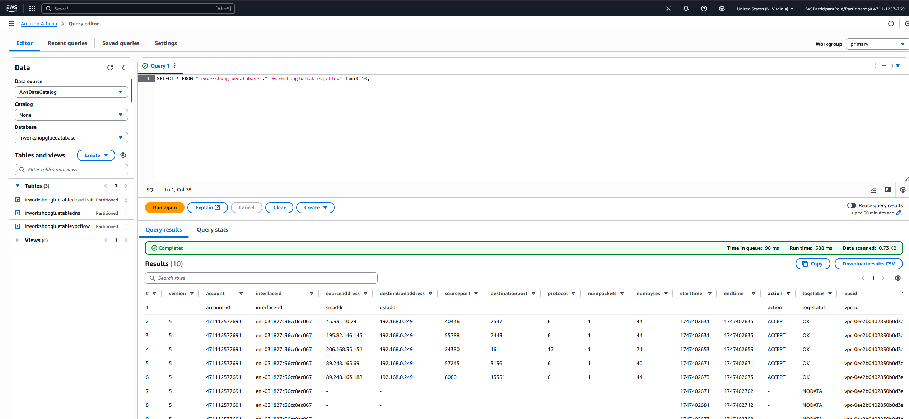

Now we can test User Activity Summary, filtering only on high volume red-only GET/LIST/DESCRIBE calls.

We can run this code to get user-related cloud trail events
```
-- User Activity Summary
-- filter high volume read-only GET/LIST/DECRIBE calls
SELECT useridentity.arn, array_agg(DISTINCT(eventname)) AS eventnames,
	array_agg(DISTINCT(sourceipaddress) ORDER BY sourceipaddress) AS sourceips,
	array_agg(DISTINCT(useragent) ORDER BY useragent) AS useragents FROM "irworkshopgluedatabase"."irworkshopgluetablecloudtrail"
WHERE eventname <> 'AssumeRole'
AND eventname NOT LIKE 'Get%'
AND eventname NOT LIKE 'List%'
AND eventname NOT LIKE 'Describe%'
AND date_partition >= '2021/07/3'
AND date_partition <= '2025/05/12'
AND account_partition = '637423349219'
AND region_partition in ('us-east-1','us-east-2','us-west-2', 'us-west-2')
GROUP BY useridentity.arn
```
Before then, make the necessary modifications to the date and account.


We can see the result showing the different events that was triggered. 


## Simulation
Ransomware occured through the use of script invoked within AWS CloudShell. The script that will be deployed mimics common activities seen by AWS CIRT (Customer Incident Response Team).
- Download script provided
- Open CloudShell and upload.


Now the script is uploaded, we can verify it byt running the ls command

- Run script
```
chmod +x ransomware_security_event_simulation.sh
./ransomware_security_event_simulation.sh
```

Once the simulation is don running, we have the simulation deployed to our environment already.

Now we can proceed to investi which is the intereating part.

## Detection
In this section we will take stesp to investigate unauthorized data exfiltration and deletion. Each subsection covers questions asked during a Ransomware incident.

### Investigation Part I - CloudTrail & Athena
Cloudtrail monitors account activities so this is our first point of interest during a Ransomware scenario.
NOTE: Make sure Cloudtrail is enabled in your environment.
In this case, we will use Athena to review and query the Cloudtrail logs

#### Q1: What is the name of the IAM user that created the bucket and what time was it created?

First thing to do in this case is to review the suspicous bucket; where the attacker left the ransomware note.
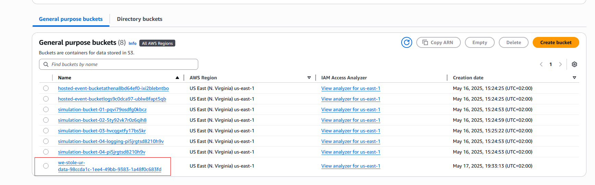
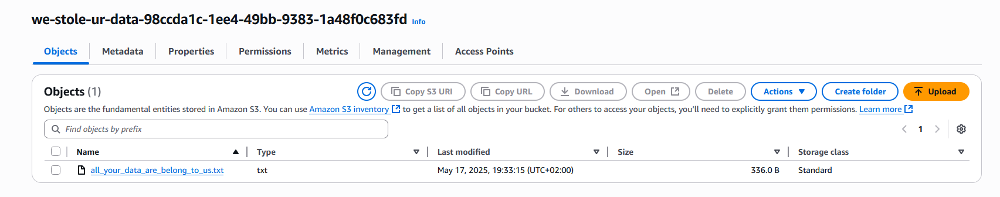

Downloading and reviewing the ransomware note, we see the data that was exfilterated, the location it was stored, the amount (ransom) requested.
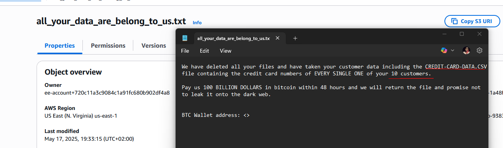

Now, we know the suspicious bucket name: `we-stole-ur-data-*` we can go to Athena, use the Queryeditor to get information fro the this bucket and also for `CreateBuckrt` API calls that will be helpful to our Investigation.

```
SELECT eventtime, eventname, useridentity, sourceipaddress, useragent, requestparameters, responseelements FROM "irworkshopgluedatabase"."irworkshopgluetablecloudtrail" where eventname = 'CreateBucket' and requestparameters like '%we-stole-ur-data-%'
```


The `."irworkshopgluetablecloudtrail"` is gotten from the tables in the Data source on the left.


We have the database called `irworkshopgluedatabase`and fetch the cloudtrail table from this databse.


Recall that we are interested in the user who created the bucket and the ransom note. So can scroll through the result horizontally the get the `useridentity`
So we scroll until we can now see the username `tdir-workshop-rroe-dev`


#### Q2: Was it the same IAM user who created the bucket that uploaded the ransom note?
We can also see the `eventtime` details about the time this event was invoked in UTC format.


The result does not show us any event for `PutObject` API calls. This logs rely on server access logging or capturing events in CloudTrail. The unauthorizeduser not enble this feature before uploading the ransomware note.
The answer to the question "What is the name of the IAM user that created the bucket and what time was it created?" is `tdir-workshop-rroe-dev` and `2025-05-17T17:33:12Z` (The time will change because I redid the lab durig documentation).

We are unable to get the answer to the question: "Was the IAM user that created the bucket the same IAM user that uploaded the ransom note?" due to lack of logging for the suspicious bucket.

We proceed to find out more actions done by the `tdir-workshop-rroe-dev` user. We filter on the `useridentity.username` parameter.

```
SELECT  eventtime, eventname, useridentity, sourceipaddress, useragent, requestparameters, responseelements FROM "irworkshopgluedatabase"."irworkshopgluetablecloudtrail" where useridentity.username = 'tdir-workshop-rroe-dev'
```
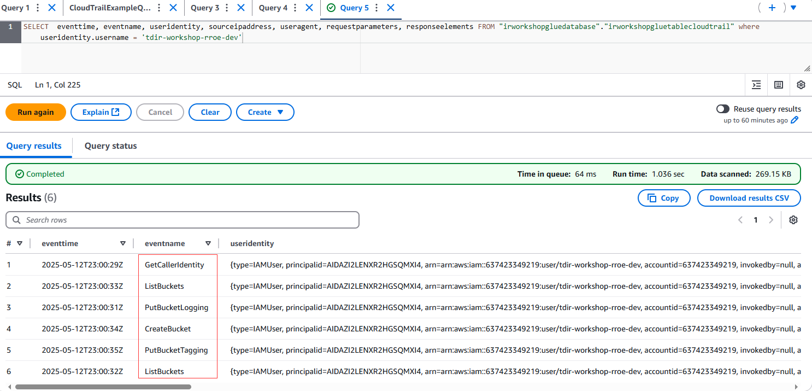
In the image, we can see the list of API calls done by the unauthorized user.
- `GetCallerIdentity`: This is similar to `whoami` command. It provides information to the caller about the credentials currently in use.
- `ListBuckets`: Lists bucket in the account
- `PutBucketLogging`: Changes logging status of an S3 bucket
- `CreateBucket`: creates buckets in an account and specifically used to create the target bucket; `we-stole-ur-data-*`
- `PutBucketTagging` creates tags for S3 buckets.

Finding out more activities tied to this user.....


### Investigation Part II
We will be answering the following questions:
#### Q3: In what bucket and prefix/folder location was the `credit-card-data.csv` object stored?
Since we know the name of the sensitive file stolen, let's use Athena query to find the initial location of this sensitive file and wheather it was indeed stolen.
NOTE: S3 buckets have data events eanbled in CloudTrail so we can search specifically for a file' data event.
```
SELECT eventtime, eventname, useridentity, sourceipaddress, useragent, requestparameters, responseelements FROM "irworkshopgluedatabase"."irworkshopgluetablecloudtrail" where requestparameters like '%credit-card-data.csv%'
```
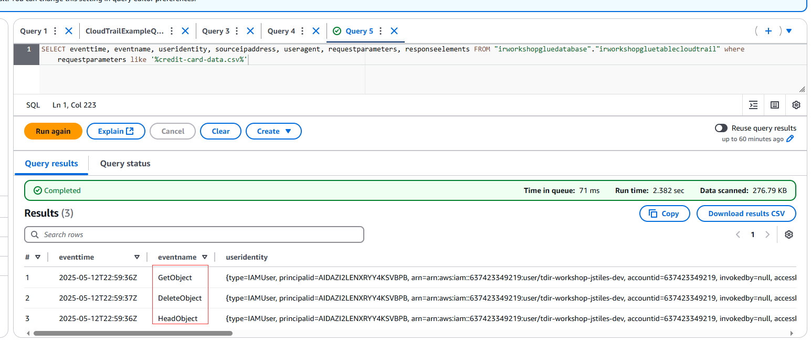
`HeadObject` and `GetObject` indicates that the objects metadata was gotten and eventually deleted (`DeleteObject`). \n
#### Q4: Did the ransomware group take the object? If so, what was the date and time?
#### Q5:Was the credit-card-data.csv object deleted?

Scrolling to the `requestparameters`, we see the object name and the bucket, the prefix/ folders `backup/customers/payment_information` in bucket `simulation-bucket-03-v05364g2uedt1ol9`. 
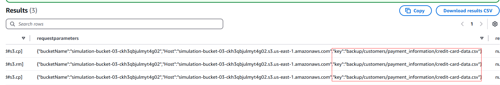
This was done at `2025-05-17T17:32:14Z`

#### Q6: What IP address and user agent did the ransomware group use to perform the unauthorized activity?
We can get this details in the `sourceipaddress` (`54.237.233.115`) and `useragent` columns (`aws-cli/2.27.13 md/awscrt#0.26.1 ua/2.1 os/linux#6.1.132-147.221.amzn2023.x86_64 md/arch#x86_64 lang/python#3.13.3 md/pyimpl#CPython exec-env/CloudShell m/G cfg`). We can also see the command that was used `cp` and `rm`
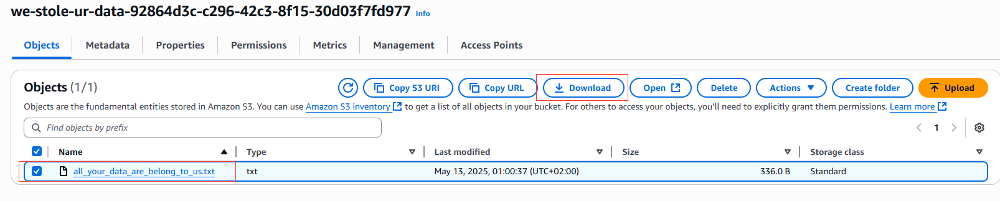

#### Q7: What is the name of the IAM user that took the object?
In the `useridentity` column we see the `username`, `tdir-workshop-jstiles-dev`. This IAM username was used to retrieve and delete the `credit-card-data.csv` file
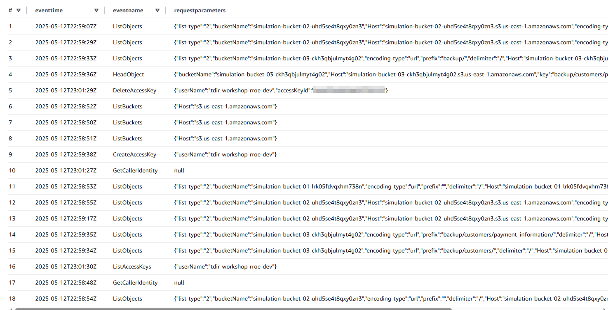

We can also see that the AWS accountid and `accesskeyid` for the `tdir-workshop-jstiles-dev` is also available in the `useridentity` column.

#### Check for other actitives done by this specific user
Since we now check if other objects were taken by this user.
```
SELECT eventtime, eventname, useridentity, sourceipaddress, useragent, requestparameters, responseelements FROM "irworkshopgluedatabase"."irworkshopgluetablecloudtrail" where eventname = 'GetObject' and useridentity.username = 'tdir-workshop-jstiles-dev'
```
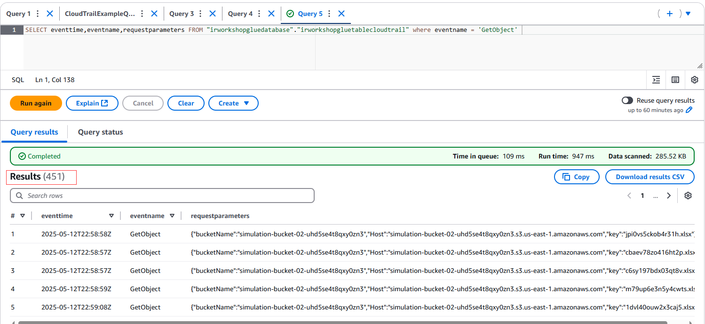
`tdir-workshop-jstiles-dev` indeed got other objects; lots of them
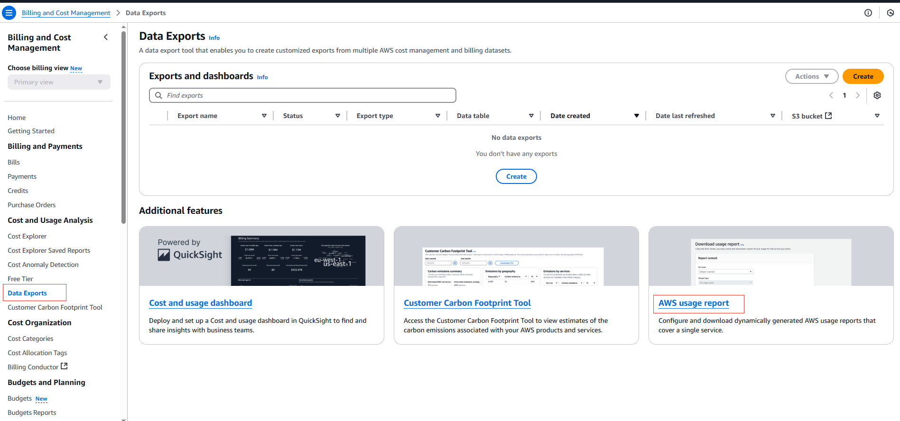
We can see that some excel files were copied.

#### Q8: What other activities were performed with this IAM user?
To get other activities, we use the same query as above but remove the `GetObject` filter, since we are interested in more API calls
```
SELECT eventtime, eventname, useridentity, sourceipaddress, useragent, requestparameters, responseelements FROM "irworkshopgluedatabase"."irworkshopgluetablecloudtrail" where useridentity.username = 'tdir-workshop-jstiles-dev'
```
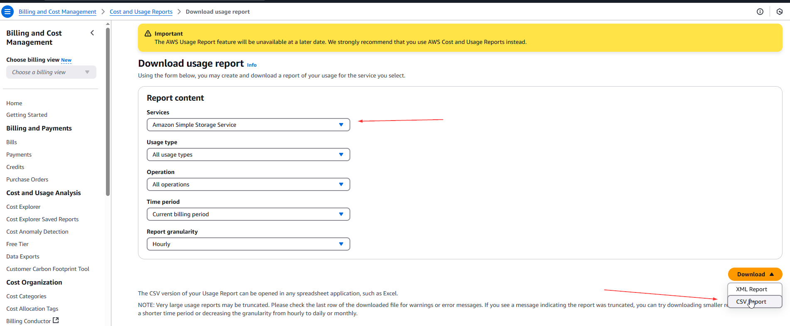
We get way too many results. We need to reduce the results by filtering out Delet and GetObjects, since we have sen them before and we are interested in other activities done by the attacker.
```
SELECT eventtime, eventname, useridentity, sourceipaddress, useragent, requestparameters, responseelements FROM "irworkshopgluedatabase"."irworkshopgluetablecloudtrail" where useridentity.username = 'tdir-workshop-jstiles-dev' and eventname != 'DeleteObject' and eventname != 'GetObject'
```
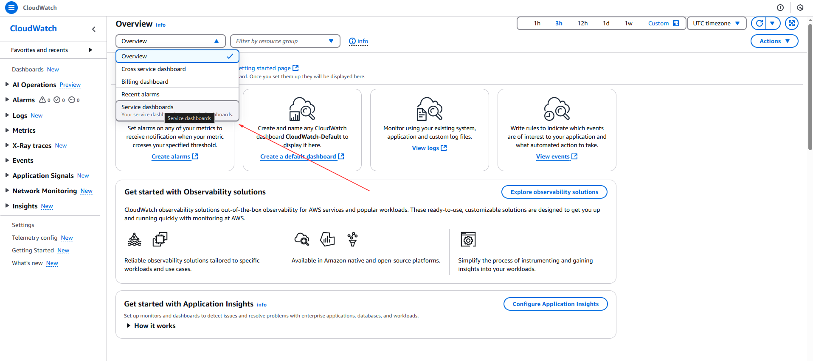

Soe definitions of the API calls made:

- `ListBuckets` unauthorized user listed the S3 buckets in the account. Unfortunately, CloudTrail does not list the results of this API command
- `ListObjects` The unauthorized user listed the S3 objects within a bucket. While the objects themselves are not listed, we can see the name of the S3 bucket containing the objects that were listed as well as the folder/prefix location in the requestparameters column
- `HeadObject` used to retrieve information about an object without retrieving the object itself
- `CreateAccessKey` creates an Access Key for a specific IAM user
- `DeleteAccessKey` deletes an Access Key for a specific IAM user
- `DeleteUser` deletes an IAM user

We will be focusing on the last 3 API calls and we only want: eventtime,eventname,requestparameters columns

```
SELECT eventtime,eventname,requestparameters FROM "irworkshopgluedatabase"."irworkshopgluetablecloudtrail" where useridentity.username = 'tdir-workshop-jstiles-dev' and eventname != 'DeleteObject' and eventname != 'GetObject'
```
sorting by eventtime we see the last four API calls made by `tdir-workshop-jstiles-dev`
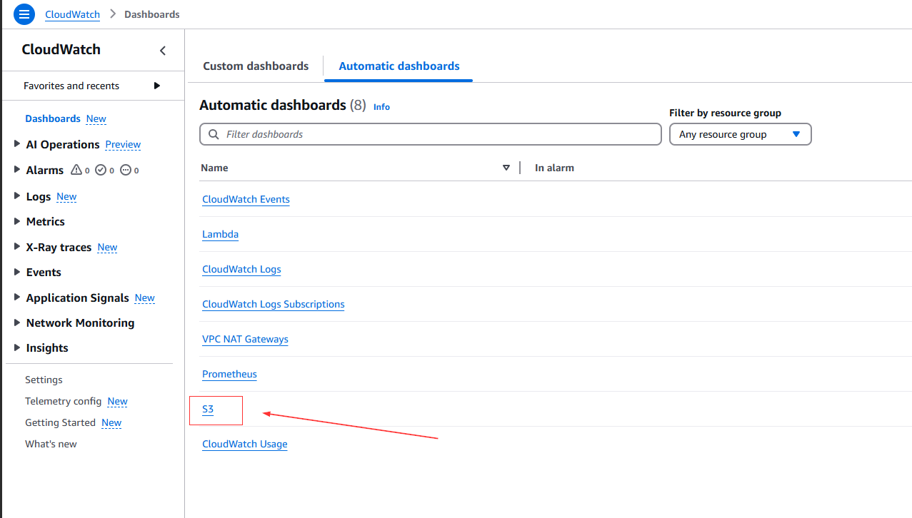
Analysis:
1. At 2025-05-17T17:32:16Z, an access key was created for user `tdir-workshop-rroe-dev`
2. At 2025-05-17T17:34:05Z, the attacker tried get detaisl for IAM user `tdir-workshop-rroe-dev` called by `tdir-workshop-jstiles-dev`
3. At 2025-05-17T17:34:07Z, `tdir-workshop-jstiles-dev` deleted access key for `tdir-workshop-rroe-dev` user
4. At 2025-05-17T17:34:08Z, keys for user `tdir-workshop-rroe-dev` were listed

Recall that the suspicious bucket was created by the `tdir-workshop-rroe-dev` user at 2025-05-17T17:33:12Z.

This timeframe shows that the event happened between step 1 and 2. So, we know that `tdir-workshop-jstiles-dev` created an accesskey for `tdir-workshop-rroe-dev` which was then used to create the suspicious bucket.

### Investigation Part III
#### Q9: Were any buckets deleted? If so, which ones?
Search for bucket deletio query
```
SELECT eventtime,eventname,requestparameters FROM "irworkshopgluedatabase"."irworkshopgluetablecloudtrail" where eventname = 'DeleteBucket'
```
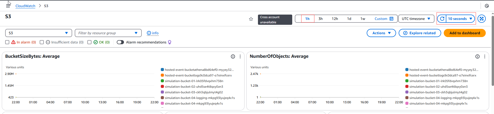

#### Q10: Were objects taken from any buckets?
To determine if any object was taken from any S3 buckets
```
SELECT eventtime,eventname,requestparameters FROM "irworkshopgluedatabase"."irworkshopgluetablecloudtrail" where eventname = 'GetObject' 
```
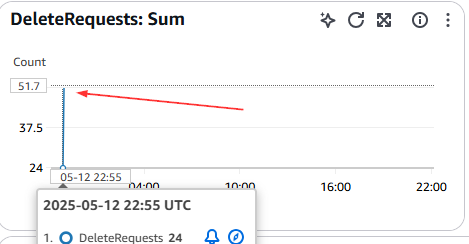
Here, we can see that multiple objects (excel files) were taken out of bucket `simulation-bucket-*`


#### Q11: How many bytes were deleted from this bucket? How many bytes were transferred out?


