# Ransomware on S3 - Simulation and Detection

This blog explains what to do or consider when investigating a ransomware scenarion that involves data exfiltration in AWS. We will explore the use of Athena to query Cloudtrail event logs.
A big shout out to Matej Macek for granting me access to this AWS workshop playground. The workshop is available [here]('https://catalog.workshops.aws/aws-cirt-ransomware-simulation-and-detection/en-US') and can be spinned up in different environment like the AWS free-tier env, and followed through.


## Setup
Download the cloud formation config file. and upload in Cloud formation

## Reviewing Logs
The key thing to look out for is the `eventname`. This gives us an idea of the action being performed or the API call made to the AWS Account. Common events to look out for include: 
- `CreateUser`
- `DescribeInstances`
- `RunInstances`
Please review some of the list and their descriptions [here]('https://catalog.us-east-1.prod.workshops.aws/event/dashboard/en-US/workshop/review').

For Querying Cloudtrail logs, we use Athena. In here, for queuries used over and over again, you find them in saved Queries. That is, if your team saved them.
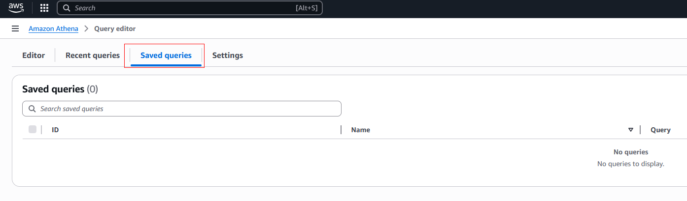


We can run this code to get user-related cloud trail events
```
-- User Activity Summary
-- filter high volume read-only GET/LIST/DECRIBE calls
SELECT useridentity.arn, array_agg(DISTINCT(eventname)) AS eventnames,
	array_agg(DISTINCT(sourceipaddress) ORDER BY sourceipaddress) AS sourceips,
	array_agg(DISTINCT(useragent) ORDER BY useragent) AS useragents FROM "irworkshopgluedatabase"."irworkshopgluetablecloudtrail"
WHERE eventname <> 'AssumeRole'
AND eventname NOT LIKE 'Get%'
AND eventname NOT LIKE 'List%'
AND eventname NOT LIKE 'Describe%'
AND date_partition >= '2021/07/3'
AND date_partition <= '2025/05/12'
AND account_partition = '637423349219'
AND region_partition in ('us-east-1','us-east-2','us-west-2', 'us-west-2')
GROUP BY useridentity.arn
```
Before then, make the necessary modifications to the date and account/
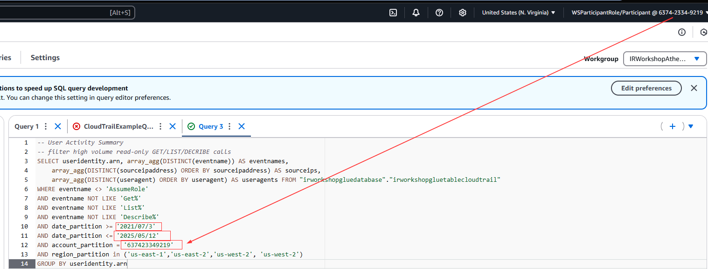

We can see the result showing the different events that was triggered. 
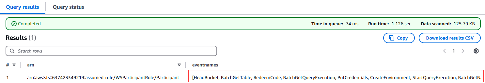

## Simulation
Ransomware occured through the use of script invoked within AWS CloudShell. The script that will be deployed mimics common activities seen by AWS CIRT (Customer Incident Response Team).
- Download script provided
- Open CloudShell and upload.
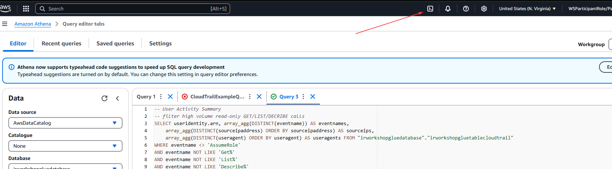
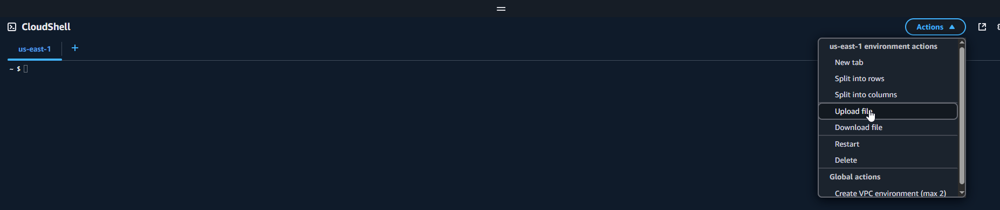
Now the script is uploaded, we can verify it byt running the ls command
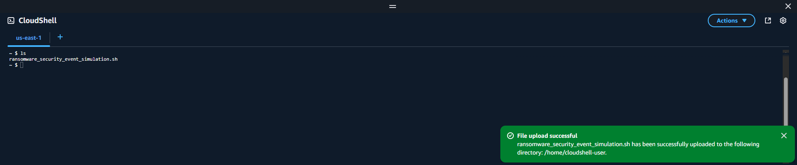
- Run script
```
chmod +x ransomware_security_event_simulation.sh
./ransomware_security_event_simulation.sh
```
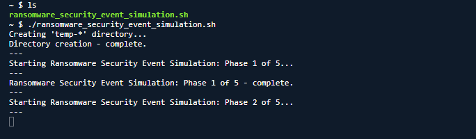
Once the simulation is don running, we have the simulation deployed to our environment already.
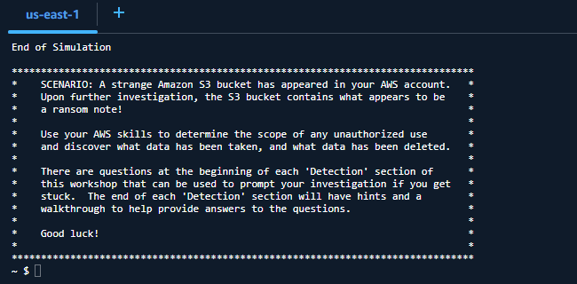
Now we can proceed to investi which is the intereating part.

## Detection
In this section we will take stesp to investigate unauthorized data exfiltration and deletion. Each subsection covers questions that are asked during a Ransomware scenario.

### Investigation Part I - CloudTrail & Athena
Cloudtrail monitors account activities so this is our first point of interest during a Ransomware scenario.
NOTE: Make sure Cloudtrail is enabled in your environment.
In this case, we will use Athena to review and query the Cloudtrail logs

- Question 1: What is the name of the IAM user that created the bucket and what time was it created?
- Question 2: Was it the same IAM user who created the bucket that uploaded teh ransom note?

```
SELECT eventtime, eventname, useridentity, sourceipaddress, useragent, requestparameters, responseelements FROM "irworkshopgluedatabase"."irworkshopgluetablecloudtrail" where eventname = 'CreateBucket' and requestparameters like '%we-stole-ur-data-%'
```

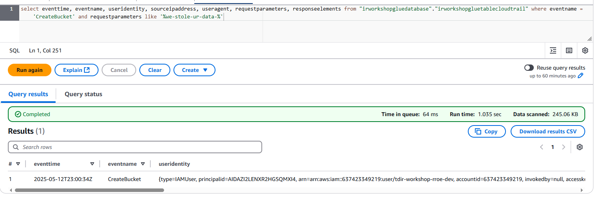

The `."irworkshopgluetablecloudtrail"` is gotten from the tables in the Data source on the left.
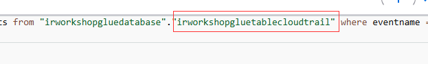

We haev the database called `irworkshopgluedatabase`and fetch the cloudtrail table from this databse.
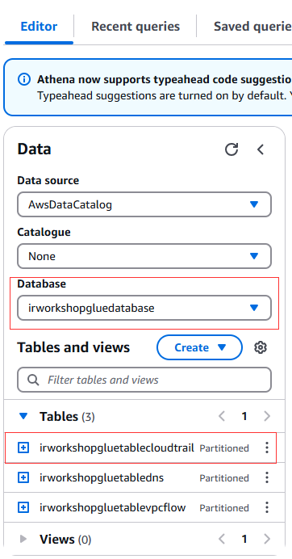

Recall that we are interested in the user who created the bucket and the ransom note. So can scroll through the result horizontally the get the `useridentity`
So we scroll until we can now see the username `tdir-workshop-rroe-dev`
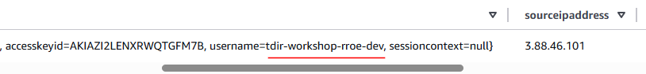

We can also see the `eventtime` details about the time this event was invoked iin UTC format.

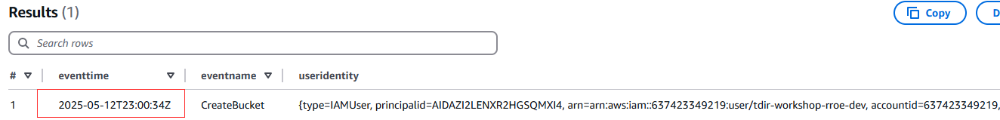
Just an addon to effect change


