# Ransomware on S3 - Simulation and Detection

This blog explains what to do or consider when investigating a ransomware scenario that involves data exfiltration in AWS. We will explore the use of Athena to query Cloudtrail event logs.
A big shout out to Matej Macek for granting me access to this AWS workshop playground. The workshop is available [here]('https://catalog.workshops.aws/aws-cirt-ransomware-simulation-and-detection/en-US') and can be deployed in different environment like using the AWS free-tier accounts, and followed through.

## In a Nutshell

- We have a timeline of event
-

## Setup

Download the cloud formation config file. and upload in Cloud formation

## Reviewing Logs

The key thing to look out for is the `eventname`. This gives us an idea of the action being performed or the API call made to the AWS Account. Common events to look out for include:

- `CreateUser`
- `DescribeInstances`
- `RunInstances`
  Please review some of the list and their descriptions [here]('https://catalog.us-east-1.prod.workshops.aws/event/dashboard/en-US/workshop/review').

For Querying Cloudtrail logs, we use Athena. On here, you find queries that can be reused in the Saved Queries tab. That is, if your team saved them. You can also save different queries in different work groups.
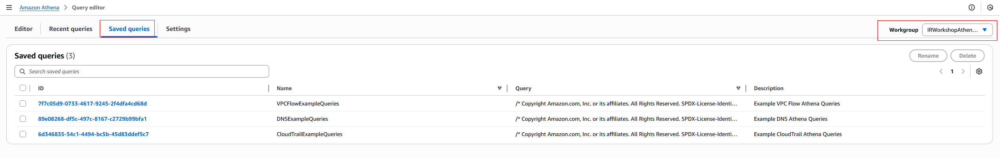

To test queries:

- Fetch data from `irworkshopgluedatabase` from the `irworkshopgluetablevpcflow` table. Limit result to 10

```SQL
SELECT * FROM "irworkshopgluedatabase"."irworkshopgluetablevpcflow" limit 10;
```

Here, we are fetching from the `AWSDataCatalog` as our datasource and we have mentioned the database and table above.


Now we can test User Activity Summary, filtering only on high volume red-only GET/LIST/DESCRIBE calls.

We can run this code to get user-related cloud trail events

```
-- User Activity Summary
-- filter high volume read-only GET/LIST/DECRIBE calls
SELECT useridentity.arn, array_agg(DISTINCT(eventname)) AS eventnames,
	array_agg(DISTINCT(sourceipaddress) ORDER BY sourceipaddress) AS sourceips,
	array_agg(DISTINCT(useragent) ORDER BY useragent) AS useragents FROM "irworkshopgluedatabase"."irworkshopgluetablecloudtrail"
WHERE eventname <> 'AssumeRole'
AND eventname NOT LIKE 'Get%'
AND eventname NOT LIKE 'List%'
AND eventname NOT LIKE 'Describe%'
AND date_partition >= '2021/07/3'
AND date_partition <= '2025/05/12'
AND account_partition = 'ACCOUNTID'
AND region_partition in ('us-east-1','us-east-2','us-west-2', 'us-west-2')
GROUP BY useridentity.arn
```

Before then, make the necessary modifications to the date and account.
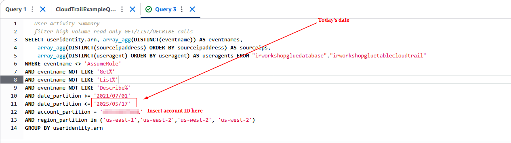

We can see the result showing the different events that was triggered.
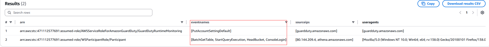

## Simulation

Ransomware occurred through the use of script invoked within AWS CloudShell. The script that will be deployed mimics common activities seen by AWS CIRT (Customer Incident Response Team).

- Download script provided
- Open CloudShell and upload.
  
  
  Now the script is uploaded, we can verify it by running the ls command
  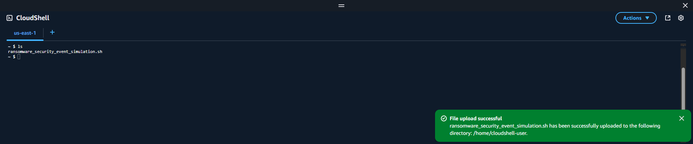
- Run script

```
chmod +x ransomware_security_event_simulation.sh
./ransomware_security_event_simulation.sh
```


Once the simulation is done running, we have the simulation deployed to our environment already.

Now we can proceed to Detection

## Detection

In this section we will take steps to investigate unauthorized data exfiltration and deletion. Each subsection covers questions asked during a Ransomware incident.

### Investigation Part I - CloudTrail & Athena

Cloudtrail monitors account activities so this is our first point of interest during a Ransomware scenario.
NOTE: Make sure Cloudtrail is enabled in your environment.
In this case, we will use Athena to review and query the Cloudtrail logs

#### Q1: What is the name of the IAM user that created the bucket and what time was it created?

First thing to do in this case is to review the suspicious bucket; where the attacker left the ransomware note.
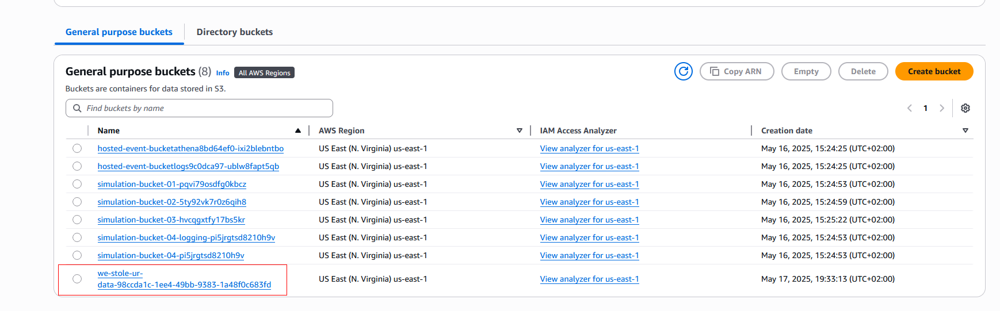
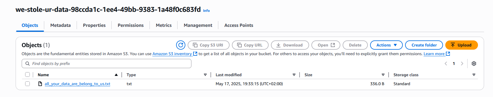

Downloading and reviewing the ransomware note, we see the data that was exfiltrated, the location it was stored, the amount (ransom) requested.


Now, we know the suspicious bucket name: `we-stole-ur-data-*` we can go to Athena, use the Query editor to get information from the this bucket and also for `CreateBucket` API calls that will be helpful to our Investigation.

```
SELECT eventtime, eventname, useridentity, sourceipaddress, useragent, requestparameters, responseelements FROM "irworkshopgluedatabase"."irworkshopgluetablecloudtrail" where eventname = 'CreateBucket' and requestparameters like '%we-stole-ur-data-%'
```

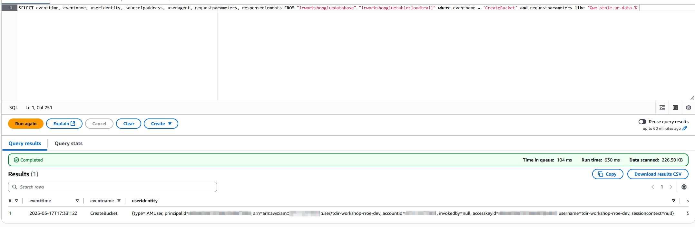

The `."irworkshopgluetablecloudtrail"` is gotten from the tables in the Data source on the left.


We have the database called `irworkshopgluedatabase`and fetch the cloudtrail table from this database.


Recall that we are interested in the user who created the bucket and the ransom note. So can scroll through the result horizontally the get the `useridentity`
So we scroll until we can now see the username `tdir-workshop-rroe-dev`
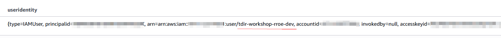

#### Q2: Was it the same IAM user who created the bucket that uploaded the ransom note?

We can also see the `eventtime` details about the time this event was invoked in UTC format.

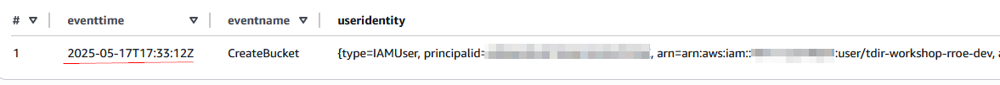

The result does not show us any event for `PutObject` API calls. This logs rely on server access logging or capturing events in CloudTrail. The unauthorized user not enable this feature before uploading the ransomware note.
The answer to the question "What is the name of the IAM user that created the bucket and what time was it created?" is `tdir-workshop-rroe-dev` and `2025-05-17T17:33:12Z` (The time will change because I redid the lab during documentation).

We are unable to get the answer to the question: "Was the IAM user that created the bucket the same IAM user that uploaded the ransom note?" due to lack of logging for the suspicious bucket.

We proceed to find out more actions done by the `tdir-workshop-rroe-dev` user. We filter on the `useridentity.username` parameter.

```
SELECT  eventtime, eventname, useridentity, sourceipaddress, useragent, requestparameters, responseelements FROM "irworkshopgluedatabase"."irworkshopgluetablecloudtrail" where useridentity.username = 'tdir-workshop-rroe-dev'
```

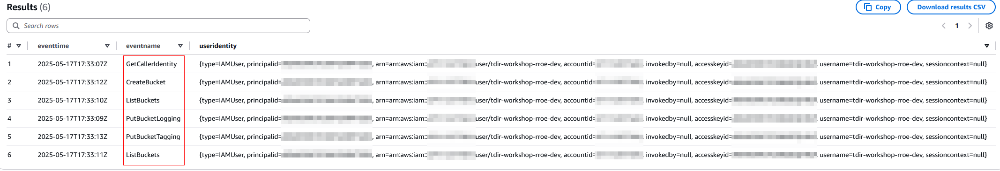
In the image, we can see the list of API calls done by the unauthorized user.

- `GetCallerIdentity`: This is similar to `whoami` command. It provides information to the caller about the credentials currently in use.
- `ListBuckets`: Lists bucket in the account
- `PutBucketLogging`: Changes logging status of an S3 bucket
- `CreateBucket`: creates buckets in an account and specifically used to create the target bucket; `we-stole-ur-data-*`
- `PutBucketTagging` creates tags for S3 buckets.

Finding out more activities tied to this user.....

### Investigation Part II

We will be answering the following questions:

#### Q3: In what bucket and prefix/folder location was the `credit-card-data.csv` object stored?

Since we know the name of the sensitive file stolen, let's use Athena query to find the initial location of this sensitive file and whether it was indeed stolen.
NOTE: S3 buckets have data events enabled in CloudTrail so we can search specifically for a file' data event.

```
SELECT eventtime, eventname, useridentity, sourceipaddress, useragent, requestparameters, responseelements FROM "irworkshopgluedatabase"."irworkshopgluetablecloudtrail" where requestparameters like '%credit-card-data.csv%'
```

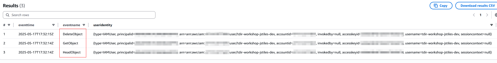
`HeadObject` and `GetObject` indicates that the objects metadata was gotten and eventually deleted (`DeleteObject`).

#### Q4: Did the ransomware group take the object? If so, what was the date and time?

#### Q5:Was the credit-card-data.csv object deleted?

Scrolling to the `requestparameters`, we see the object name and the bucket, the prefix/ folders `backup/customers/payment_information` in bucket `simulation-bucket-03-v05364g2uedt1ol9`.
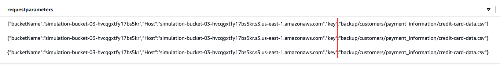
This was done at `2025-05-17T17:32:14Z`

#### Q6: What IP address and user agent did the ransomware group use to perform the unauthorized activity?

We can get this details in the `sourceipaddress` (`54.237.233.115`) and `useragent` columns (`aws-cli/2.27.13 md/awscrt#0.26.1 ua/2.1 os/linux#6.1.132-147.221.amzn2023.x86_64 md/arch#x86_64 lang/python#3.13.3 md/pyimpl#CPython exec-env/CloudShell m/G cfg`). We can also see the command that was used `cp` and `rm`
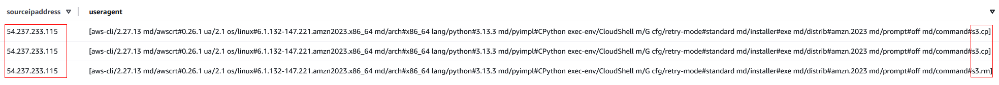

#### Q7: What is the name of the IAM user that took the object?

In the `useridentity` column we see the `username`, `tdir-workshop-jstiles-dev`. This IAM username was used to retrieve and delete the `credit-card-data.csv` file
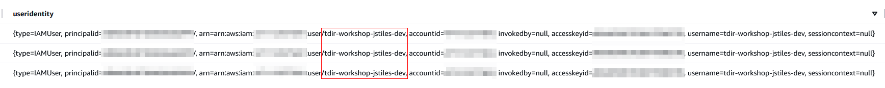

We can also see that the AWS accountid and `accesskeyid` for the `tdir-workshop-jstiles-dev` is also available in the `useridentity` column.

#### Check for other activities done by this specific user

Since we now check if other objects were taken by this user.

```
SELECT eventtime, eventname, useridentity, sourceipaddress, useragent, requestparameters, responseelements FROM "irworkshopgluedatabase"."irworkshopgluetablecloudtrail" where eventname = 'GetObject' and useridentity.username = 'tdir-workshop-jstiles-dev'
```

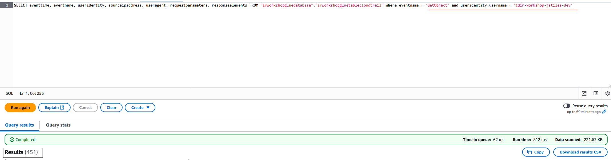
`tdir-workshop-jstiles-dev` indeed got other objects; lots of them
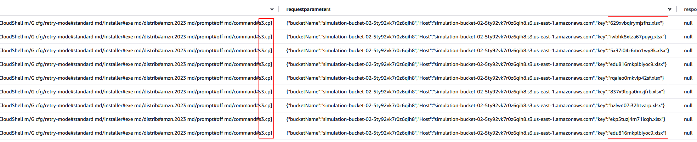
We can see that some excel files were copied.

#### Q8: What other activities were performed with this IAM user?

To get other activities, we use the same query as above but remove the `GetObject` filter, since we are interested in more API calls

```
SELECT eventtime, eventname, useridentity, sourceipaddress, useragent, requestparameters, responseelements FROM "irworkshopgluedatabase"."irworkshopgluetablecloudtrail" where useridentity.username = 'tdir-workshop-jstiles-dev'
```

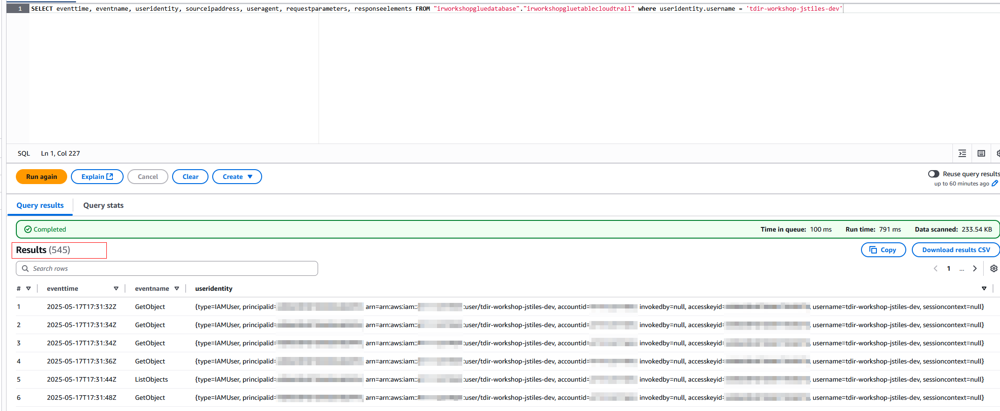
We get way too many results. We need to reduce the results by filtering out Delet and GetObjects, since we have sen them before and we are interested in other activities done by the attacker.

```
SELECT eventtime, eventname, useridentity, sourceipaddress, useragent, requestparameters, responseelements FROM "irworkshopgluedatabase"."irworkshopgluetablecloudtrail" where useridentity.username = 'tdir-workshop-jstiles-dev' and eventname != 'DeleteObject' and eventname != 'GetObject'
```

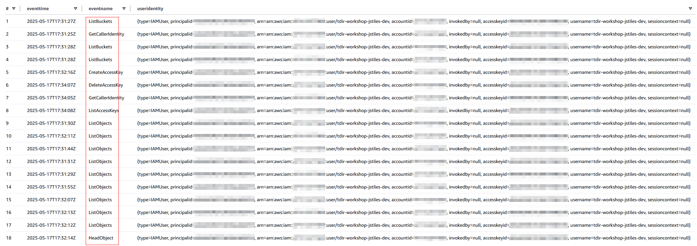

Some definitions of the API calls made:

- `ListBuckets` unauthorized user listed the S3 buckets in the account. Unfortunately, CloudTrail does not list the results of this API command
- `ListObjects` The unauthorized user listed the S3 objects within a bucket. While the objects themselves are not listed, we can see the name of the S3 bucket containing the objects that were listed as well as the folder/prefix location in the requestparameters column
- `HeadObject` used to retrieve information about an object without retrieving the object itself
- `CreateAccessKey` creates an Access Key for a specific IAM user
- `DeleteAccessKey` deletes an Access Key for a specific IAM user
- `DeleteUser` deletes an IAM user

We will be focusing on the last 3 API calls and we only want: eventtime,eventname,requestparameters columns

```
SELECT eventtime,eventname,requestparameters FROM "irworkshopgluedatabase"."irworkshopgluetablecloudtrail" where useridentity.username = 'tdir-workshop-jstiles-dev' and eventname != 'DeleteObject' and eventname != 'GetObject'
```

sorting by eventtime we see the last four API calls made by `tdir-workshop-jstiles-dev`
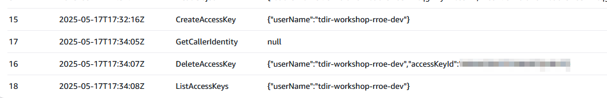
Analysis:

1. At 2025-05-17T17:32:16Z, an access key was created for user `tdir-workshop-rroe-dev`
2. At 2025-05-17T17:34:05Z, the attacker tried get detaisl for IAM user `tdir-workshop-rroe-dev` called by `tdir-workshop-jstiles-dev`
3. At 2025-05-17T17:34:07Z, `tdir-workshop-jstiles-dev` deleted access key for `tdir-workshop-rroe-dev` user
4. At 2025-05-17T17:34:08Z, keys for user `tdir-workshop-rroe-dev` were listed

Recall that the suspicious bucket was created by the `tdir-workshop-rroe-dev` user at 2025-05-17T17:33:12Z.

This timeframe shows that the event happened between step 1 and 2. So, we know that `tdir-workshop-jstiles-dev` created an accesskey for `tdir-workshop-rroe-dev` which was then used to create the suspicious bucket.

From before..

We saw that the `tdir-workshop-rroe-dev` user can only perform limited function as seen Creatbucket, listbucket, tagging, etc. The event by the `tdir-workshop-rroe-dev` user stopped at
2025-05-17T17:33:13Z after which the `tdir-workshop-jstiles-dev` user immediately started making API calls. The last activities of `tdir-workshop-jstiles-dev` user is deleting access keys and listing the access keys to make sure it was deleted.

### Investigation Part III - CloudWatch

#### Q9: Were any buckets deleted? If so, which ones?

Search for bucket deletion query

```
SELECT eventtime,eventname,requestparameters FROM "irworkshopgluedatabase"."irworkshopgluetablecloudtrail" where eventname = 'DeleteBucket'
```

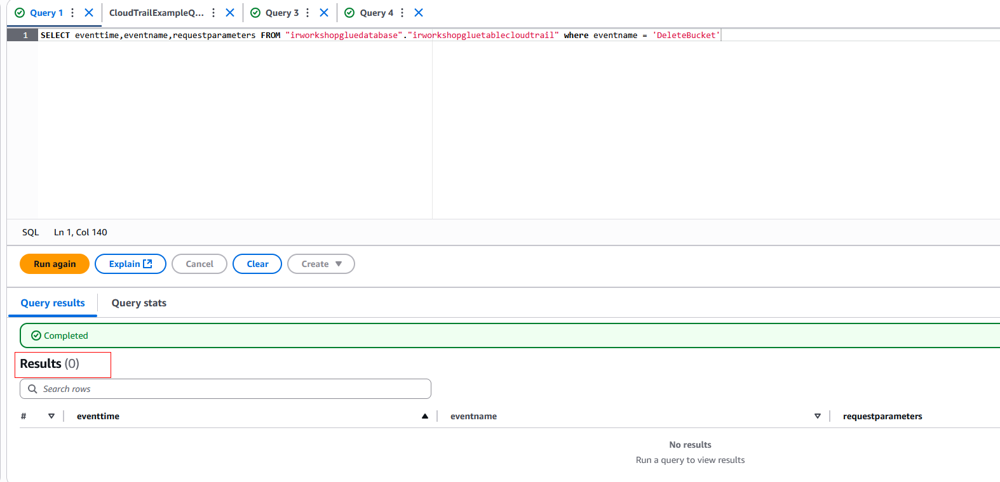

#### Q10: Were objects taken from any buckets?

To determine if any object was taken from any S3 buckets

```
SELECT eventtime,eventname,requestparameters FROM "irworkshopgluedatabase"."irworkshopgluetablecloudtrail" where eventname = 'GetObject'
```

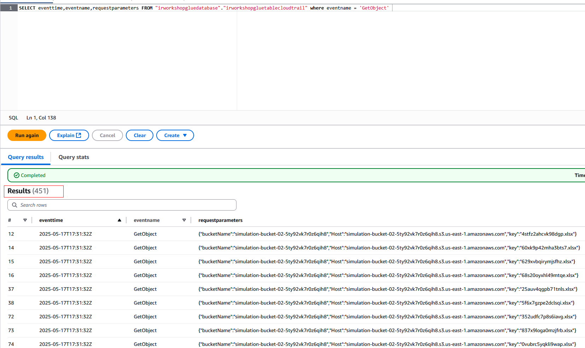

Here, we can see that multiple objects (excel files) were taken out of bucket `simulation-bucket-*`

#### Q11: How many bytes were deleted from this bucket? How many bytes were transferred out?

To get the bytes downloaded from S3 buckets we look at Billing and Cost Management, then select Data Exports. Then look at AWS Usage Report
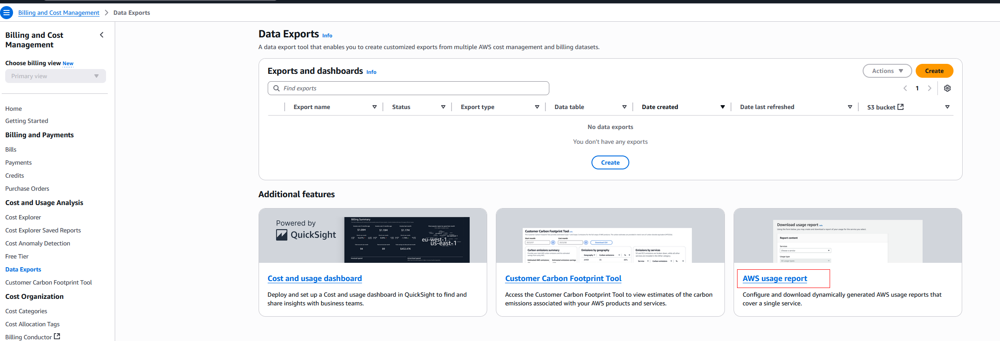

Under services, we select Amazon Simple Storage Service and download CSV report.
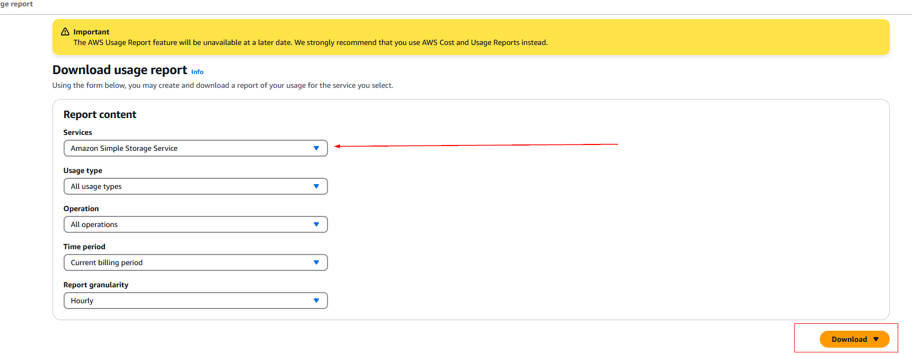

After download, we can open the csv file and sort by UsageValue. In this file, we are interested in the GetObject and DeletecObject Calls; these are
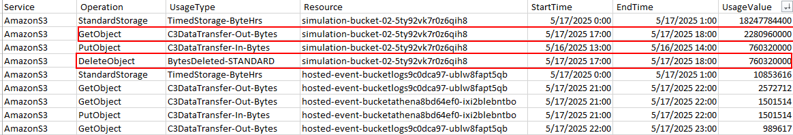

`2280960000` bytes of files were taken from the `simulation-bucket-02-5ty92vk7r0z6qih8` and `760320000` bytes of files were deleted from the same bucket.

Cloudwatch can also be used to view S3 metrics. Key metrics to look out for are: `DeleteRequests: Sum` and `BytesDownloaded: Sum`. This provide sum of total delete requests and downloaded bytes which are good indicators of ransomware activities.
On the AWS Console, go to CloudWatch, select Service dashboard, select S3
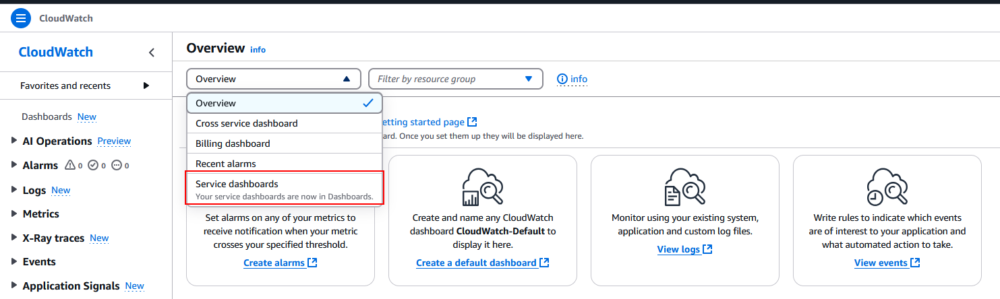

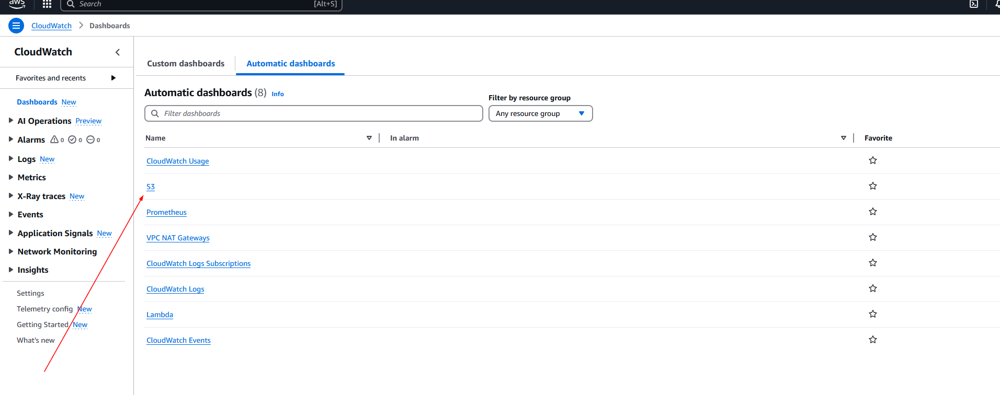

Here, change refresh time to 10 seconds and time range to 1 hour.
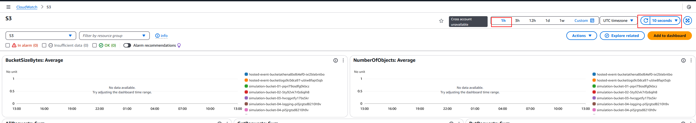

Let's look at `DeleteRequests: Sum` tab, we see a marker indicating the total number of requests for deletions. In this case, we have 75.


In the `BytesDownloaded: Sum` tab, we can see we have 2,281,077,404 of downloaded bytes, which is close to the GetObject API call we saw in the previous CSV file.
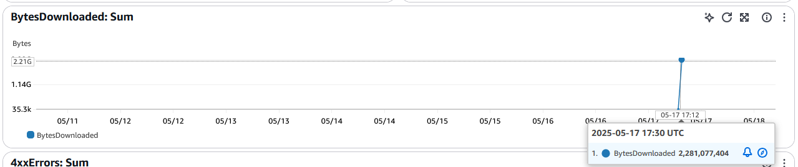

This provides additional evidence for Data exfiltration and deletion

### Investigation Part Investigation - GuardDuty

#### Q12: It seems as if Server Access Logging was disabled. What was the name of the IAM user that disabled Server Access Logging?

GuardDuty tells us whether the server access logging was disabled. So we can go to GuardDuty and review the alerts on there.
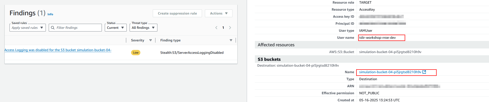
We see the AccessLoggingDisabled alert on S3, the affected resources and the IAM user who disabled logging for the S3 bucket: `tdir-workshop-rroe-dev`.

#### Q13: What time was it disabled?

Digging Deeper into the `Action` section of the alert, we see the time, the API call made to disable logging and the IP address of the attacker.
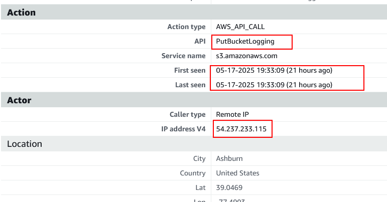

#### Q14: What was the API call that was made to disable Server Access Logging?

From the image above: `PutBucketLogging`

#### Q15: The customer has made you aware of another top-secret, highly confidential file: `company-secrets.doc`. Was this object deleted? Was it taken?

We can search for activities made to the highly confidential `company-secrets.doc` file using Athena.

```
SELECT eventtime, eventname, useridentity, sourceipaddress, useragent, requestparameters, responseelements FROM "irworkshopgluedatabase"."irworkshopgluetablecloudtrail" where requestparameters like '%company-secrets.doc%'
```

We get no result here, indicating that, we cannot say whether the file was accessed or deleted. We dont have evidence to prove this.

To move forward with the Investigation, since we saw that the `PutBucketLogging` API used by the attacker, we use Athena to filter through this event.

```
SELECT eventtime, eventname, useridentity, sourceipaddress, useragent, requestparameters, responseelements FROM "irworkshopgluedatabase"."irworkshopgluetablecloudtrail" where eventname = 'PutBucketLogging'
```

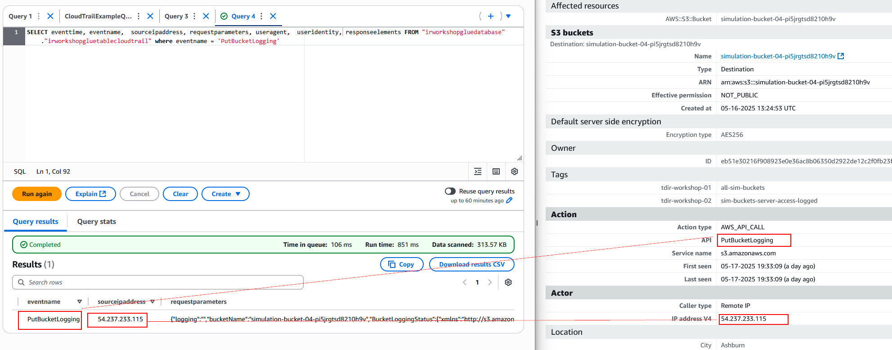
Comparing GuardDuty and Athena results, we can confirm the source ip address is `54.237.233.115`

Also, checking for the logging status of the S3 bucket to verify. We can check on CloudShell

```
aws s3api get-bucket-logging --bucket simulation-bucket-04-pi5jrgtsd8210h9v
```

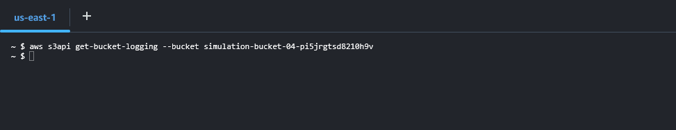

We can go to the S3 bucket itself to reconfigure logging
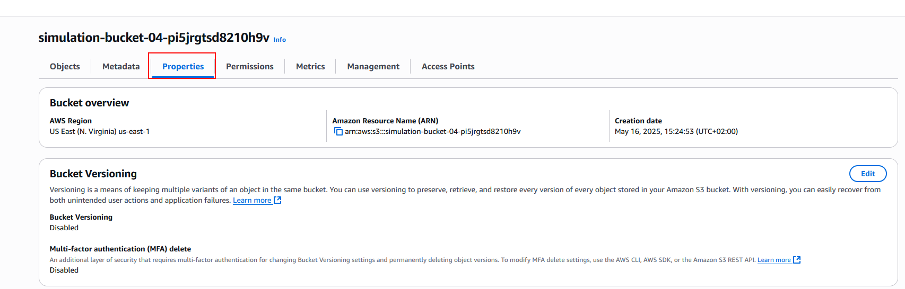


Now, when we run the same `get-bucket-logging` command...


Logging is now enabled

## Lesson Learned

- Do not panic, you have a game plan, stick with it.
- Your key tools for investigation process are Athena to query Cloudtrail & VPCflow logs, GuardDuty, AWS Billing & Cost Management and CloudWatch
- Remember there could be more than one malicious IAM user
- Get a timeline of events, and crosscheck every user activity with suspicious API calls. Do not focus on one user alone.
- For resources claimed to be stolen, verify if it is indeed stolen, check if you have an offline backup of these files as well.
- Remember to enable logging on important resources on your environment.
- Make sure GuardDuty. CloudWatch and CloudTrail are enabled in your environment
