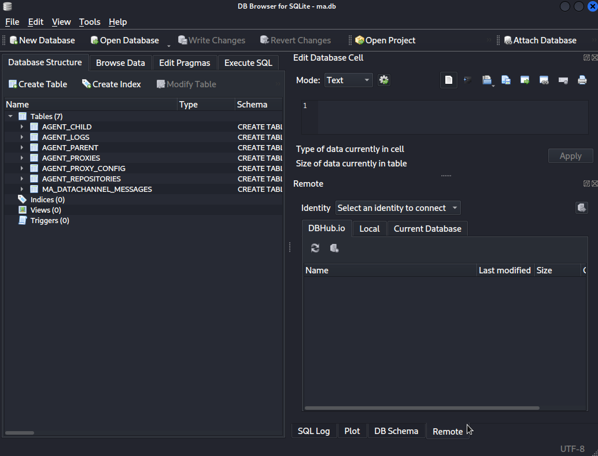
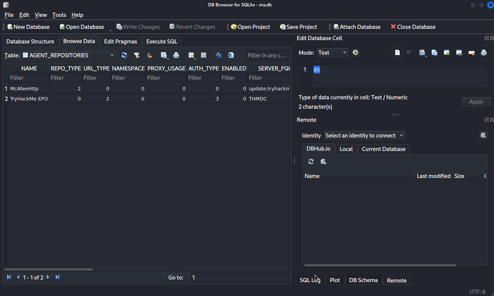
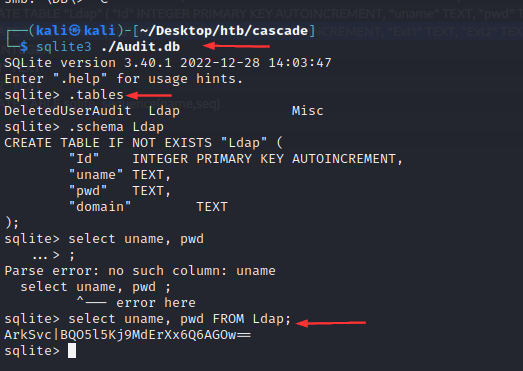
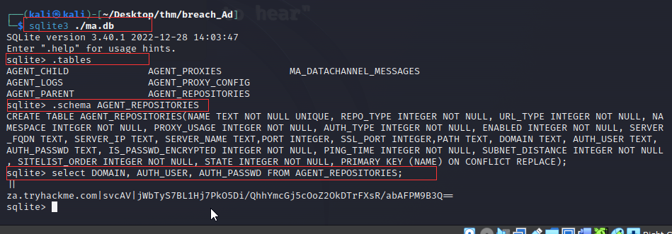
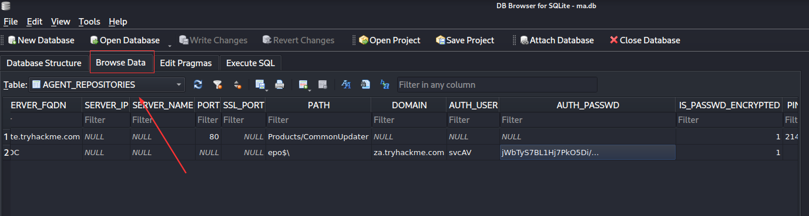
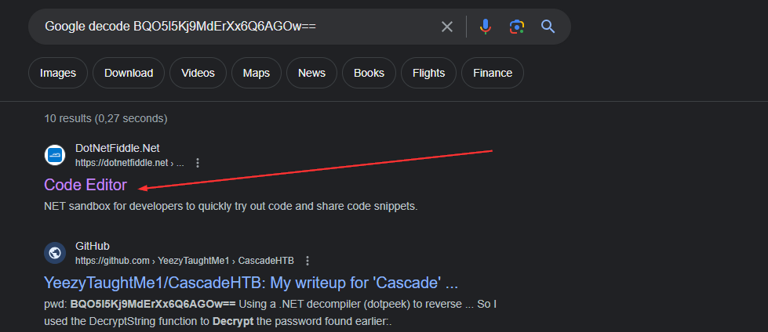
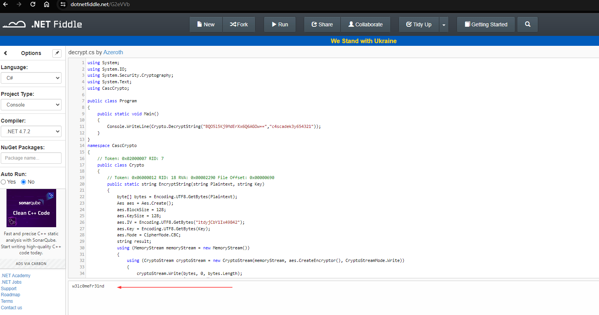

## SQLite browser

:::note[sqlitebrowser] We are using sqlite browser found on kali machine. We use it to visulaize the ma.db file found on the tryhackme room.

See Config files section here:
https://tryhackme.com/room/breachingad



OR

```
sqlite3 ./Audit.db
.tables
.schema Ldap
select uname, pwd FROM Ldap;
```





Decode sqlite password
https://dotnetfiddle.net/G2eVVb

Google decode BQO5l5Kj9MdErXx6Q6AGOw==



Decrypt sqlite3
[https://github.com/funoverip/mcafee-sitelist-pwd-decryption](https://github.com/funoverip/mcafee-sitelist-pwd-decryption)
